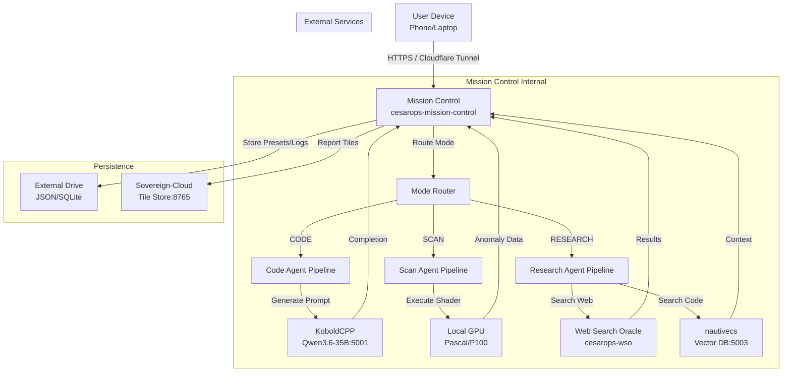

# CESAROPS Mission Control: Unified Architecture Spec

## 1. System Overview & Philosophy

**Goal:** A single, accessible, voice-driven interface that abstracts the complexity of the underlying hardware (KoboldCPP, nautivecs, WSO, Sovereign-Cloud) into three simple modes: **CODE**, **SCAN**, and **RESEARCH**.

**Core Principle:** *Zero Configuration, High Visibility.* The user never touches a terminal. They speak or click, and the system orchestrates the distributed agents.

**Architecture Decision:**
We will build **`cesarops-mission-control`** as a standalone Rust binary. It will act as the "Frontend Server," serving the UI directly via `axum` and embedding static assets (HTML/CSS/JS). It will communicate with existing services via HTTP (OpenAI-compatible for KoboldCPP, REST for nautivecs/WSO/Sovereign-Cloud).

*Why not embed in sovereign-cloud?* Sovereign-cloud is specialized for cluster coordination. Adding a heavy web UI layer risks coupling the control plane to the data plane. A separate binary keeps the system modular and allows us to scale the UI independently if needed.

---

## 2. Component Connections (System Diagram)



### Routing Logic
The `Router` in `Mission Control` inspects the user's input or selected mode:
1.  **CODE:** Routes to `CodeAgent`. Calls KoboldCPP with a system prompt optimized for Rust compilation and error fixing. Queries `nautivecs` for existing patterns.
2.  **SCAN:** Routes to `ScanAgent`. Queries `Sovereign-Cloud` for weather/tile status. Triggers local GPU shaders via a gRPC/HTTP endpoint (or just local binary execution). Aggregates results.
3.  **RESEARCH:** Routes to `ResearchAgent`. Uses the existing `ResearchEngine` logic from `cesarops-mcp-steered`. Fires parallel queries to `WSO` and `nautivecs`. Synthesizes via KoboldCPP.

---

## 3. API Routes & Internal Structure

The `Mission Control` server exposes these REST/WebSocket endpoints:

### WebSocket Stream (`/ws`)
Real-time progress updates are pushed to the client via WebSocket. This is critical for long-running tasks (scanning/synthesis).

*   **Event: `task_start`** `{ mode: "SCAN", id: "scan_001", message: "Initializing Mackinac Straits scan..." }`
*   **Event: `progress`** `{ step: 2, total: 5, detail: "Downloading tile A4..." }`
*   **Event: `llm_token`** `{ text: "...the anomaly score is high at..." }` (for streaming thought)
*   **Event: `result`** `{ mode: "SCAN", data: { anomalies: [...], report_url: "/reports/scan_001.pdf" } }`

### REST API

| Method | Path | Description |
|--------|------|-------------|
| GET | `/` | Serve the main UI (index.html) |
| GET | `/presets` | List available presets |
| POST | `/presets` | Save a new preset |
| GET | `/status` | Health check of underlying services (KoboldCPP, nautivecs, etc.) |
| POST | `/task` | Submit a new task: `{ mode: "CODE", input: "Build tidal calc", preset_id: "code_review" }` |
| GET | `/logs/{id}` | Retrieve logs for a completed task |

### Internal Agent Interfaces

*   **CodeAgent:**
    *   `compile_code(source: &str) -> Result<CompileOutput>`
    *   `run_tests(binary_path: &Path) -> Result<TestOutput>`
*   **ScanAgent:**
    *   `get_weather_forecast(lat: f64, lon: f64) -> WeatherData`
    *   `run_tile_analysis(tile_id: String) -> AnomalyReport`
*   **ResearchAgent:**
    *   `search_web(query: &str) -> Vec<Finding>`
    *   `search_codebase(query: &str) -> Vec<ContextFragment>`
    *   `synthesize(findings: Vec<Finding>) -> ResearchPaper`

---

## 4. The Three Modes: Detailed Logic

### CODE Mode
1.  **Input:** User speaks/typing: "Create a function to calculate tidal coefficients for Lake Michigan."
2.  **Planning:** KoboldCPP generates a plan:
    *   Step 1: Query `nautivecs` for existing hydrological models.
    *   Step 2: Draft Rust code.
    *   Step 3: Compile and test.
3.  **Execution:**
    *   `nautivecs` returns relevant snippets (e.g., `tide_calc.rs`).
    *   KoboldCPP writes new code, incorporating snippets.
    *   System compiles locally (`rustc` or `cargo build`).
    *   If compilation fails, KoboldCPP is asked to fix the error (loop up to 3 times).
4.  **Output:** UI shows:
    *   ✅ Plan Approved
    *   📄 Code Diff (highlighted changes)
    *   ⚙️ Compile Status: Success
    *   🚀 Deploy Button (copies binary to deploy dir)

### SCAN Mode
1.  **Input:** User clicks "Auto Scan" or says: "Scan Mackinac Straits."
2.  **Planning:** Sovereign-Cloud checks weather. If wind < 5 knots, proceed.
3.  **Execution:**
    *   Download recent satellite tiles for region.
    *   Run GPU shader (anomaly detection) on local hardware.
    *   Filter anomalies by confidence threshold.
4.  **Output:** UI shows:
    *   🌤️ Weather: Clear (Good for scanning)
    *   🗺️ Map with bounding box
    *   🔍 Scanning... (animated progress bar)
    *   🚩 Anomalies Found: 3 (High Confidence)
    *   📊 Report Link

### RESEARCH Mode
1.  **Input:** User says: "Latest on SAR bathymetry?"
2.  **Planning:** ResearchEngine decomposes query into sub-queries.
3.  **Execution:**
    *   Parallel fetch: WSO (web) + nautivecs (codebase).
    *   Conflict detection: If web says X and code says Y, flag it.
    *   Synthesis: KoboldCPP generates a structured report with citations.
4.  **Output:** UI shows:
    *   🔍 Searching Web...
    *   🔍 Searching Codebase...
    *   📝 Synthesizing...
    *   📄 Final Paper (with clickable citations)

---

## 5. UI Requirements (Accessibility-First)

### Design Principles
*   **Dyslexia-Friendly:** Use `OpenDyslexic` font or `Lexend` (highly readable sans-serif). High contrast (black text on off-white background). No justified text (use left-aligned).
*   **Large Targets:** Buttons min-height: 60px. Min-width: 120px.
*   **Voice Input:** Browser’s `SpeechRecognition` API. Visual indicator when listening (pulsing microphone icon).
*   **Progress Visualization:** Icons + short phrases. No walls of text.
    *   Example: `🔄 Planning` → `🔍 Searching` → `✍️ Writing` → `✅ Done`
*   **Mobile-First:** Responsive layout. Single-column stack on mobile.

### HTML/JS Frontend Concept (Minimal Viable)

```html
<!DOCTYPE html>
<html lang="en">
<head>
    <meta charset="UTF-8">
    <meta name="viewport" content="width=device-width, initial-scale=1.0">
    <title>CESAROPS Mission Control</title>
    <style>
        :root {
            --bg-color: #f4f4f9;
            --text-color: #1a1a1a;
            --primary: #0057b7;
            --success: #28a745;
            --warning: #ffc107;
            --font-main: 'Lexend', sans-serif; /* Dyslexia-friendly */
        }
        body {
            font-family: var(--font-main);
            background: var(--bg-color);
            color: var(--text-color);
            margin: 0;
            padding: 20px;
            display: flex;
            flex-direction: column;
            align-items: center;
        }
        h1 { font-size: 2.5rem; text-align: center; }
        
        /* Mode Buttons */
        .mode-buttons {
            display: grid;
            grid-template-columns: repeat(3, 1fr);
            gap: 20px;
            width: 100%;
            max-width: 800px;
            margin: 30px 0;
        }
        .mode-btn {
            background: white;
            border: 3px solid var(--primary);
            border-radius: 15px;
            padding: 30px;
            font-size: 1.5rem;
            font-weight: bold;
            cursor: pointer;
            transition: transform 0.2s, box-shadow 0.2s;
            text-align: center;
        }
        .mode-btn:hover {
            transform: scale(1.05);
            box-shadow: 0 5px 15px rgba(0,0,0,0.2);
        }
        .mode-btn.active {
            background: var(--primary);
            color: white;
        }

        /* Input Area */
        .input-area {
            width: 100%;
            max-width: 800px;
            margin-top: 20px;
        }
        textarea {
            width: 100%;
            height: 100px;
            font-family: var(--font-main);
            font-size: 1.2rem;
            padding: 15px;
            border: 2px solid #ccc;
            border-radius: 10px;
            resize: none;
        }
        .voice-btn {
            background: #ff4081;
            color: white;
            border: none;
            border-radius: 50%;
            width: 60px;
            height: 60px;
            font-size: 1.5rem;
            cursor: pointer;
            margin-left: 10px;
        }
        .voice-btn.listening {
            animation: pulse 1.5s infinite;
        }
        @keyframes pulse {
            0% { transform: scale(1); }
            50% { transform: scale(1.1); }
            100% { transform: scale(1); }
        }

        /* Progress & Results */
        .progress-bar {
            width: 100%;
            height: 30px;
            background: #ddd;
            border-radius: 15px;
            margin-top: 20px;
            overflow: hidden;
            display: none;
        }
        .progress-fill {
            height: 100%;
            background: var(--success);
            width: 0%;
            transition: width 0.3s;
        }
        .result-box {
            background: white;
            border: 2px solid #ccc;
            border-radius: 10px;
            padding: 20px;
            margin-top: 20px;
            max-height: 400px;
            overflow-y: auto;
            display: none;
        }
        .step-icon {
            font-size: 1.5rem;
            margin-right: 10px;
        }
        .step-item {
            display: flex;
            align-items: center;
            margin: 10px 0;
            font-size: 1.1rem;
        }
        .step-item.completed { color: var(--success); }
        .step-item.active { color: var(--primary); font-weight: bold; }
    </style>
</head>
<body>
    <h1>CESAROPS Mission Control</h1>

    <div class="mode-buttons">
        <button class="mode-btn" onclick="selectMode('CODE')">🛠️ CODE</button>
        <button class="mode-btn" onclick="selectMode('SCAN')">🛰️ SCAN</button>
        <button class="mode-btn" onclick="selectMode('RESEARCH')">🔬 RESEARCH</button>
    </div>

    <div class="input-area">
        <textarea id="user-input" placeholder="Describe your mission..."></textarea>
        <button class="voice-btn" id="voice-btn" onclick="toggleVoice()">🎤</button>
        <button class="mode-btn" style="margin-top:10px; width:100%;" onclick="submitTask()">Start Mission</button>
    </div>

    <div class="progress-bar" id="progress-bar">
        <div class="progress-fill" id="progress-fill"></div>
    </div>

    <div class="result-box" id="result-box">
        <!-- Steps and results injected here -->
    </div>

    <script>
        let currentMode = null;
        const ws = new WebSocket(`ws://${window.location.host}/ws`);

        function selectMode(mode) {
            currentMode = mode;
            document.querySelectorAll('.mode-btn').forEach(btn => btn.classList.remove('active'));
            event.target.classList.add('active');
            document.getElementById('user-input').placeholder = `Enter ${mode} task...`;
        }

        function toggleVoice() {
            if (!('webkitSpeechRecognition' in window)) {
                alert('Speech recognition not supported in this browser.');
                return;
            }
            const recognition = new webkitSpeechRecognition();
            recognition.continuous = false;
            recognition.interimResults = false;
            recognition.lang = 'en-US';

            const btn = document.getElementById('voice-btn');
            btn.classList.add('listening');

            recognition.onstart = () => console.log('Voice active');
            recognition.onend = () => btn.classList.remove('listening');
            
            recognition.onresult = (event) => {
                const transcript = event.results[0][0].transcript;
                document.getElementById('user-input').value += transcript;
            };

            recognition.start();
        }

        function submitTask() {
            const input = document.getElementById('user-input').value;
            if (!currentMode || !input) return;

            // Send to server via WebSocket or HTTP POST
            fetch('/task', {
                method: 'POST',
                headers: { 'Content-Type': 'application/json' },
                body: JSON.stringify({ mode: currentMode, input })
            })
            .then(response => response.json())
            .then(data => {
                showProgress();
                listenToWebSocket(data.task_id);
            });
        }

        function showProgress() {
            document.getElementById('progress-bar').style.display = 'block';
            document.getElementById('result-box').style.display = 'block';
        }

        function listenToWebSocket(taskId) {
            ws.onmessage = (event) => {
                const msg = JSON.parse(event.data);
                if (msg.task_id !== taskId) return;

                if (msg.type === 'progress') {
                    updateProgressBar(msg.percent);
                    addStep(msg.message, msg.icon);
                } else if (msg.type === 'result') {
                    displayResult(msg.data);
                }
            };
        }

        function updateProgressBar(percent) {
            document.getElementById('progress-fill').style.width = percent + '%';
        }

        function addStep(message, icon) {
            const box = document.getElementById('result-box');
            const step = document.createElement('div');
            step.className = 'step-item active';
            step.innerHTML = `<span class="step-icon">${icon}</span> ${message}`;
            box.prepend(step);
        }

        function displayResult(data) {
            // Display final result based on mode
            const box = document.getElementById('result-box');
            box.innerHTML += `<h2>Mission Complete</h2><pre>${JSON.stringify(data, null, 2)}</pre>`;
        }
    </script>
</body>
</html>
```

---

## 6. Preset System Design

Presets are stored as JSON files in `~/.cesarops/presets/` (or on the external drive). They define pre-configured tasks.

### Preset Structure (`preset.json`)
```json
{
  "id": "morning_scan",
  "name": "Morning Scan",
  "mode": "SCAN",
  "input_template": "Check overnight weather and scan all tiles marked 'pending' in Mackinac Straits.",
  "parameters": {
    "region": "Mackinac Straits",
    "weather_threshold": 5.0,
    "confidence_min": 0.7
  },
  "ui_config": {
    "icon": "🌅",
    "color": "#ff9800"
  }
}
```

### Implementation
*   **Load:** On startup, `Mission Control` reads all `.json` files from the presets directory.
*   **Display:** UI shows a dropdown or grid of preset cards.
*   **Execute:** Clicking a preset auto-fills the input field and sets the mode. User can edit before submitting.

---

## 7. Deployment Plan

### TODAY (Minimal Viable Product)
1.  **Build `cesarops-mission-control`:**
    *   Simple `axum` server serving `index.html`.
    *   WebSocket endpoint `/ws`.
    *   HTTP POST `/task` that calls existing services (KoboldCPP, nautivecs, WSO) via their current APIs.
    *   No GPU shader integration yet (mock it or use simple CLI).
2.  **Deploy:**
    *   Compile binary.
    *   Run on server: `./cesarops-mission-control --port 3000`.
    *   Expose via Cloudflare Tunnel.
3.  **Test:** Use browser to click buttons, send messages, see progress.

### NEXT WEEK (Enhanced)
1.  **GPU Integration:** Add endpoint to trigger local GPU shaders for SCAN mode.
2.  **Voice Input:** Fully implement SpeechRecognition in frontend.
3.  **Preset System:** Implement JSON loading and UI display.
4.  **Compilable Code Mode:** Integrate `rustc` compilation step in CODE mode.

### FUTURE (Capstone)
1.  **Mobile App:** Wrap web UI in Tauri/Electron for native desktop/mobile experience.
2.  **Advanced Analytics:** Real-time dashboard for scan results.
3.  **Multi-User Support:** Role-based access control (if multiple users need access).

This architecture provides a unified, accessible, and powerful interface for CESAROPS, leveraging all existing components while adding a critical layer of usability.