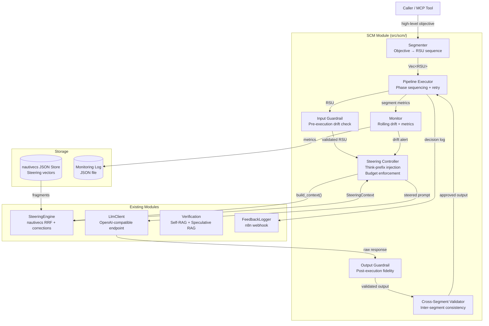
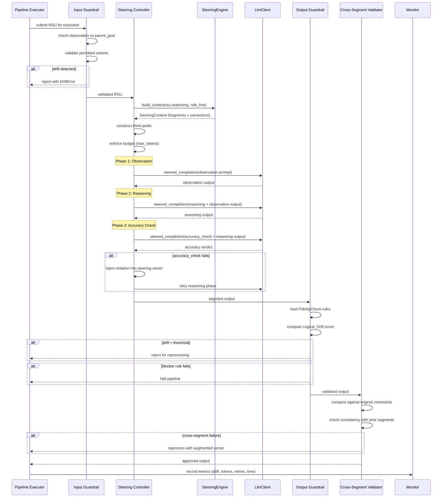

# Design Document: Segmented Context Manager (SCM)

## Overview

The Segmented Context Manager (SCM) is the core orchestration module that decomposes complex prompts into structured sub-tasks called RSUs (Region SPEC Units), steers each segment's execution toward accuracy via think-prefixes, and validates outputs against fidelity rules before committing results. It extends the existing `cesarops-mcp-steered` crate by adding a closed-loop pipeline: **decompose → steer → validate → synthesize**.

The SCM builds on the existing `SteeringEngine` (nautivecs-based context injection) and `LlmClient` (OpenAI-compatible endpoint) without duplicating their functionality. It adds:

1. **RSU Schema** — JSON-LD structured records defining atomic sub-tasks with phases and execution parameters
2. **Segmenter** — Decomposes high-level objectives into ordered RSU sequences using the LLM
3. **Steering Controller** — Non-bypassable layer that injects think-prefixes and enforces budget guidance
4. **Input/Output Guardrails** — Pre-execution drift detection and post-execution fidelity validation
5. **Cross-Segment Validator** — Ensures no segment contradicts prior outputs or the original intent
6. **Monitoring** — Rolling drift metrics, retry tracking, and budget exhaustion logging

**Key design decisions:**
- **Adaptive drift thresholds**: High-precision segments (logic/math/parameters) use strict 0.05 threshold; exploratory segments (research/synthesis) use relaxed 0.15. This prevents creative-but-accurate research from triggering false retry loops.
- **Phase sequence is strict**: observation → reasoning → accuracy_check. No phase can execute out of order.
- **SteeringEngine is reused, not wrapped**: The SCM calls `SteeringEngine::build_context` directly for each RSU, passing the RSU's domain as `role_hint`.
- **Storage via nautivecs JSON store**: No LanceDB or Arrow. All persistence uses the existing serverless JSON store.
- **Module lives at `cesarops-mcp-steered/src/scm/`** as a submodule with multiple files.

## Architecture



### Execution Flow (Single RSU)



## Components and Interfaces

### Module Structure

```
cesarops-mcp-steered/src/scm/
├── mod.rs              // Public API, re-exports
├── rsu.rs              // RSU schema, parsing, serialization
├── segmenter.rs        // Objective decomposition into RSUs
├── steering_ctrl.rs    // Think-prefix injection, budget enforcement
├── guardrail.rs        // Input + Output guardrails
├── validator.rs        // Cross-segment validation, FidelityCheck schema
├── pipeline.rs         // Phase execution, retry logic, pipeline coordination
├── monitor.rs          // Rolling drift metrics, structured query interface
└── drift.rs            // DriftMonitor trait, adaptive threshold implementations
```

### Core Traits

#### DriftMonitor (Adaptive Threshold)

The central abstraction for drift detection. Two implementations provide the adaptive behavior:

```rust
/// Trait for computing and evaluating logical drift between a segment's
/// output and its original constraints.
pub trait DriftMonitor: Send + Sync {
    /// Compute the drift score (0.0–1.0) between output and constraints.
    fn compute_drift(&self, output: &str, constraints: &str) -> f32;

    /// Return the threshold for this monitor instance.
    fn threshold(&self) -> f32;

    /// Check if the given drift score exceeds the threshold.
    fn exceeds_threshold(&self, drift_score: f32) -> bool {
        drift_score > self.threshold()
    }

    /// Return the segment mode this monitor is configured for.
    fn mode(&self) -> SegmentMode;
}

/// High-precision segments: logic, math, parameter tuning.
/// Strict threshold of 0.05 — any drift is likely a real error.
pub struct StrictDriftMonitor {
    threshold: f32, // 0.05
}

/// Exploratory segments: research, synthesis, architecture.
/// Relaxed threshold of 0.15 — creative connections are expected.
pub struct FluidDriftMonitor {
    threshold: f32, // 0.15
}
```

**Design rationale**: A single global threshold causes "creativity tax" — valid exploratory connections (e.g., linking a SAR texture pattern to a known wreck signature) trigger retries because they appear to drift from the literal prompt. The adaptive approach lets precision work stay strict while research work breathes.

#### PhaseExecutor

```rust
/// Executes the three-phase sequence for a single RSU.
/// Guarantees strict ordering: observation → reasoning → accuracy_check.
pub struct PhaseExecutor<'a> {
    llm: &'a LlmClient,
    steering: &'a mut SteeringEngine,
    budget: BudgetConfig,
}

impl<'a> PhaseExecutor<'a> {
    /// Execute all three phases in order. Returns the final output
    /// or an error if accuracy_check fails after max retries.
    pub async fn execute(&mut self, rsu: &Rsu) -> Result<PhaseOutput>;
}
```

#### PipelineCoordinator

```rust
/// Manages the full segment chain: sequencing, cross-segment validation,
/// retry logic, and monitoring.
pub struct PipelineCoordinator {
    segmenter: Segmenter,
    steering_ctrl: SteeringController,
    input_guardrail: InputGuardrail,
    output_guardrail: OutputGuardrail,
    cross_validator: CrossSegmentValidator,
    monitor: Monitor,
    max_retries: u32, // default: 3
}

impl PipelineCoordinator {
    /// Execute a full pipeline from a high-level objective.
    /// Returns all segment outputs or a structured failure report.
    pub async fn execute_objective(
        &mut self,
        objective: &str,
        llm: &LlmClient,
        steering: &mut SteeringEngine,
    ) -> Result<PipelineResult>;

    /// Resume a halted pipeline from the failed segment.
    pub async fn resume(
        &mut self,
        state: PipelineState,
        llm: &LlmClient,
        steering: &mut SteeringEngine,
    ) -> Result<PipelineResult>;
}
```

#### SteeringController

```rust
/// Non-bypassable steering layer. Every RSU passes through here
/// before reaching the LlmClient.
pub struct SteeringController {
    /// Selects the appropriate DriftMonitor based on RSU's steering_policy
    drift_monitors: DriftMonitorFactory,
}

impl SteeringController {
    /// Build the steered prompt for an RSU. This is the ONLY path
    /// to the LlmClient — direct calls are not permitted.
    pub async fn steer_and_execute(
        &self,
        rsu: &Rsu,
        phase: Phase,
        prior_output: Option<&str>,
        steering: &mut SteeringEngine,
        llm: &LlmClient,
    ) -> Result<String>;

    /// Select the drift monitor based on the RSU's steering_policy.
    fn select_monitor(&self, policy: &SteeringPolicy) -> Box<dyn DriftMonitor>;
}
```

#### InputGuardrail / OutputGuardrail

```rust
/// Pre-execution check: validates RSU before it reaches the LLM.
pub struct InputGuardrail {
    permitted_actions: HashSet<String>,
}

impl InputGuardrail {
    /// Validate an RSU against drift and action constraints.
    /// Must complete within 50ms for RSUs < 1000 chars.
    pub fn validate(&self, rsu: &Rsu, prior_outputs: &[SegmentOutput]) -> Result<()>;
}

/// Post-execution check: validates segment output against fidelity rules.
pub struct OutputGuardrail;

impl OutputGuardrail {
    /// Validate output against the FidelityCheck rules referenced by the RSU.
    /// Returns the computed drift score alongside the validation result.
    pub fn validate(
        &self,
        output: &str,
        rsu: &Rsu,
        fidelity_check: &FidelityCheck,
        monitor: &dyn DriftMonitor,
    ) -> Result<ValidationResult>;
}
```

#### CrossSegmentValidator

```rust
/// Validates that Segment N's output is consistent with:
/// 1. The original high-level objective
/// 2. All prior segment outputs (1..N-1)
pub struct CrossSegmentValidator;

impl CrossSegmentValidator {
    /// Compare segment output against constraints and prior outputs.
    pub fn validate(
        &self,
        segment_output: &str,
        original_objective: &str,
        prior_outputs: &[SegmentOutput],
    ) -> Result<CrossValidationResult>;
}
```

#### Monitor

```rust
/// Tracks rolling drift metrics and exposes a structured query interface.
pub struct Monitor {
    /// Rolling window of last 5 segment drift scores
    drift_window: VecDeque<f32>,
    /// All recorded segment metrics
    metrics: Vec<SegmentMetrics>,
}

impl Monitor {
    /// Record metrics for a completed segment.
    pub fn record(&mut self, metrics: SegmentMetrics);

    /// Compute rolling average drift over the last N segments.
    pub fn rolling_drift_average(&self, window: usize) -> f32;

    /// Check if steering intensity should be increased.
    pub fn should_increase_steering(&self) -> bool;

    /// Query all metrics (for the structured query interface).
    pub fn query_metrics(&self) -> MonitoringSummary;
}
```

### Integration Points with Existing Modules

| SCM Component | Existing Module | Integration Method |
|---|---|---|
| SteeringController | `SteeringEngine` | Calls `build_context(query, role_hint, tool_name)` |
| SteeringController | `LlmClient` | Calls `steered_completion(system_context, user_query)` |
| OutputGuardrail | `verification.rs` | Reuses `detect_missing_context()` for Self-RAG signals |
| PipelineCoordinator | `FeedbackLogger` | Emits decision logs via n8n webhook |
| Segmenter | `LlmClient` | Uses `chat_completion()` for decomposition planning |
| Monitor | nautivecs JSON store | Persists metrics to `scm_metrics.json` |


## Data Models

### RSU (Region SPEC Unit) — JSON-LD Schema

```json
{
  "@context": "https://kiro.ai",
  "@type": "SegmentTask",
  "id": "segment_001",
  "meta": {
    "parent_goal": "Analyze the thermal anomaly in tile B02_20240715 for wreck signatures",
    "thinking_budget": "medium",
    "steering_ref": "steering/accuracy-guardrail.md",
    "steering_policy": {
      "mode": "precision",
      "drift_threshold": 0.05
    },
    "context_ttl_seconds": 30,
    "created_at": "2024-07-15T10:30:00Z"
  },
  "phases": {
    "observation": "Load prior segment outputs for tile B02_20240715. Query nautivecs for thermal band processing functions.",
    "reasoning": "Compare thermal delta against known wreck heat-sink signatures. Apply band ratio threshold from calibration data.",
    "accuracy_check": "Verify that the identified anomaly coordinates fall within the tile bounds and that the thermal delta exceeds the minimum detection threshold of 2.5°C."
  },
  "execution": {
    "action": "queryNautivecs",
    "parameters": {
      "query": "thermal anomaly detection band ratio",
      "top_k": 5
    }
  },
  "dependencies": ["segment_000"]
}
```

### Rust RSU Types

```rust
use chrono::{DateTime, Utc};
use serde::{Deserialize, Serialize};

/// The segment execution mode — controls drift threshold selection.
#[derive(Debug, Clone, Copy, PartialEq, Eq, Serialize, Deserialize)]
#[serde(rename_all = "lowercase")]
pub enum SegmentMode {
    /// Logic, math, parameter tuning — strict 0.05 threshold
    Precision,
    /// Research, synthesis, architecture — relaxed 0.15 threshold
    Exploratory,
}

/// Steering policy embedded in each RSU's meta.
#[derive(Debug, Clone, Serialize, Deserialize)]
pub struct SteeringPolicy {
    pub mode: SegmentMode,
    pub drift_threshold: f32,
}

impl SteeringPolicy {
    pub fn precision() -> Self {
        Self { mode: SegmentMode::Precision, drift_threshold: 0.05 }
    }
    pub fn exploratory() -> Self {
        Self { mode: SegmentMode::Exploratory, drift_threshold: 0.15 }
    }
}

/// Thinking budget classification — controls token allocation.
#[derive(Debug, Clone, Copy, PartialEq, Eq, Serialize, Deserialize)]
#[serde(rename_all = "lowercase")]
pub enum ThinkingBudget {
    /// 512 tokens reasoning, 1024 total
    Low,
    /// 2048 tokens reasoning, 4096 total
    Medium,
    /// 4096 tokens reasoning, 8192 total
    High,
}

impl ThinkingBudget {
    pub fn reasoning_tokens(&self) -> u32 {
        match self {
            Self::Low => 512,
            Self::Medium => 2048,
            Self::High => 4096,
        }
    }

    pub fn total_tokens(&self) -> u32 {
        match self {
            Self::Low => 1024,
            Self::Medium => 4096,
            Self::High => 8192,
        }
    }
}

/// RSU metadata block.
#[derive(Debug, Clone, Serialize, Deserialize)]
pub struct RsuMeta {
    pub parent_goal: String,
    pub thinking_budget: ThinkingBudget,
    pub steering_ref: String,
    pub steering_policy: SteeringPolicy,
    /// Context TTL in seconds — aggressive pruning for low-VRAM hardware.
    /// After this duration, the segment's context is eligible for eviction.
    pub context_ttl_seconds: u32,
    pub created_at: DateTime<Utc>,
}

/// The three execution phases within an RSU.
#[derive(Debug, Clone, Serialize, Deserialize)]
pub struct RsuPhases {
    pub observation: String,
    pub reasoning: String,
    pub accuracy_check: String,
}

/// Execution action specification.
#[derive(Debug, Clone, Serialize, Deserialize)]
pub struct RsuExecution {
    pub action: String,
    pub parameters: serde_json::Value,
}

/// The complete RSU (Region SPEC Unit).
#[derive(Debug, Clone, Serialize, Deserialize)]
pub struct Rsu {
    #[serde(rename = "@context")]
    pub context: String, // "https://kiro.ai"
    #[serde(rename = "@type")]
    pub rsu_type: String, // "SegmentTask"
    pub id: String,
    pub meta: RsuMeta,
    pub phases: RsuPhases,
    pub execution: RsuExecution,
    #[serde(default)]
    pub dependencies: Vec<String>,
}

/// Permitted execution actions (whitelist).
pub const PERMITTED_ACTIONS: &[&str] = &[
    "writeFile",
    "readFile",
    "runCommand",
    "queryNautivecs",
];
```

### FidelityCheck — JSON-LD Schema

```json
{
  "@context": "https://kiro.ai",
  "@type": "FidelityCheck",
  "validation_rules": [
    {
      "rule": "strict_schema_enforcement",
      "description": "Output must not contain fields or structures not defined in the validated schema",
      "severity": "blocker"
    },
    {
      "rule": "canonical_serialization",
      "description": "Tool calls must be regenerated through the trusted serializer",
      "severity": "blocker"
    },
    {
      "rule": "citation_required",
      "description": "Every code reference must include source file path and line range",
      "severity": "warning"
    }
  ],
  "monitoring": {
    "threshold": 0.05,
    "rolling_window": 5,
    "escalation_threshold": 0.03
  }
}
```

### Rust FidelityCheck Types

```rust
/// Severity level for a fidelity rule.
#[derive(Debug, Clone, Copy, PartialEq, Eq, Serialize, Deserialize)]
#[serde(rename_all = "lowercase")]
pub enum RuleSeverity {
    /// Pipeline halts immediately if this rule fails.
    Blocker,
    /// Violation is logged but pipeline continues.
    Warning,
}

/// A single validation rule within a FidelityCheck.
#[derive(Debug, Clone, Serialize, Deserialize)]
pub struct ValidationRule {
    pub rule: String,
    pub description: String,
    pub severity: RuleSeverity,
}

/// Monitoring configuration within a FidelityCheck.
#[derive(Debug, Clone, Serialize, Deserialize)]
pub struct MonitoringConfig {
    /// Drift threshold (0.0–1.0). Overridden by RSU's steering_policy.
    pub threshold: f32,
    /// Number of segments in the rolling average window.
    pub rolling_window: usize,
    /// Rolling average threshold that triggers increased steering.
    pub escalation_threshold: f32,
}

/// The complete FidelityCheck schema.
#[derive(Debug, Clone, Serialize, Deserialize)]
pub struct FidelityCheck {
    #[serde(rename = "@context")]
    pub context: String, // "https://kiro.ai"
    #[serde(rename = "@type")]
    pub check_type: String, // "FidelityCheck"
    pub validation_rules: Vec<ValidationRule>,
    pub monitoring: MonitoringConfig,
}
```

### Pipeline State and Output Types

```rust
/// Output from a single phase execution.
#[derive(Debug, Clone, Serialize, Deserialize)]
pub struct PhaseOutput {
    pub phase: Phase,
    pub content: String,
    pub tokens_used: u32,
    pub elapsed_ms: u64,
}

/// Which phase is being executed.
#[derive(Debug, Clone, Copy, PartialEq, Eq, Serialize, Deserialize)]
pub enum Phase {
    Observation,
    Reasoning,
    AccuracyCheck,
}

/// Complete output from a single segment's execution.
#[derive(Debug, Clone, Serialize, Deserialize)]
pub struct SegmentOutput {
    pub rsu_id: String,
    pub phases: Vec<PhaseOutput>,
    pub drift_score: f32,
    pub retries: u32,
    pub status: SegmentStatus,
}

/// Status of a completed segment.
#[derive(Debug, Clone, Copy, PartialEq, Eq, Serialize, Deserialize)]
pub enum SegmentStatus {
    /// All checks passed.
    Completed,
    /// Budget exhausted but accuracy check passed.
    BudgetExhausted,
    /// Proceeded without nautivecs context (store unreachable).
    Unsteered,
    /// Failed after max retries.
    Failed,
}

/// Metrics recorded for each segment (for monitoring).
#[derive(Debug, Clone, Serialize, Deserialize)]
pub struct SegmentMetrics {
    pub rsu_id: String,
    pub drift_score: f32,
    pub tokens_used: u32,
    pub retries: u32,
    pub elapsed_ms: u64,
    pub segment_mode: SegmentMode,
    pub status: SegmentStatus,
    pub timestamp: DateTime<Utc>,
}

/// Summary exposed by the monitoring query interface.
#[derive(Debug, Clone, Serialize, Deserialize)]
pub struct MonitoringSummary {
    pub total_segments_processed: usize,
    pub average_drift: f32,
    pub total_retries: u32,
    pub budget_exhaustion_count: u32,
    pub segments_by_mode: (usize, usize), // (precision, exploratory)
}

/// Full pipeline result.
#[derive(Debug, Clone, Serialize, Deserialize)]
pub struct PipelineResult {
    pub objective: String,
    pub segments: Vec<SegmentOutput>,
    pub total_elapsed_ms: u64,
    pub monitoring: MonitoringSummary,
}

/// Saved pipeline state for resume capability.
#[derive(Debug, Clone, Serialize, Deserialize)]
pub struct PipelineState {
    pub objective: String,
    pub rsus: Vec<Rsu>,
    pub completed_outputs: Vec<SegmentOutput>,
    pub failed_segment_index: usize,
    pub retry_count: u32,
}

/// Validation result from the output guardrail.
#[derive(Debug, Clone)]
pub struct ValidationResult {
    pub drift_score: f32,
    pub passed: bool,
    pub blocker_failures: Vec<String>,
    pub warning_failures: Vec<String>,
}

/// Result from cross-segment validation.
#[derive(Debug, Clone)]
pub enum CrossValidationResult {
    /// Output is consistent with all constraints.
    Pass,
    /// Output contradicts a specific constraint — include the violation detail.
    Fail { violation: String, contradicted_segment: Option<String> },
}
```

### Adaptive Drift Threshold Algorithm

The drift threshold selection follows this logic:

```rust
impl SteeringController {
    fn select_monitor(&self, policy: &SteeringPolicy) -> Box<dyn DriftMonitor> {
        match policy.mode {
            SegmentMode::Precision => Box::new(StrictDriftMonitor {
                threshold: policy.drift_threshold, // 0.05
            }),
            SegmentMode::Exploratory => Box::new(FluidDriftMonitor {
                threshold: policy.drift_threshold, // 0.15
            }),
        }
    }
}

/// When nautivecs is unreachable and segment runs unsteered,
/// override the threshold to be extra strict regardless of mode.
fn unsteered_threshold_override(base_threshold: f32) -> f32 {
    // Clamp to 0.02 — unsteered segments get minimal tolerance
    base_threshold.min(0.02)
}

/// When rolling average drift exceeds escalation_threshold (0.03),
/// the monitor signals the SteeringController to add constraint
/// reminders to subsequent think-prefixes.
impl Monitor {
    pub fn should_increase_steering(&self) -> bool {
        self.rolling_drift_average(5) > 0.03
    }
}
```

### Context TTL and VRAM Management

For Pascal GPUs (GTX 1060 6GB, GTX 1070 8GB, P1000 4GB), aggressive context pruning is critical:

```rust
/// Context TTL configuration per budget tier.
/// Lower VRAM = shorter TTL = more aggressive pruning.
impl ThinkingBudget {
    pub fn default_context_ttl_seconds(&self) -> u32 {
        match self {
            Self::Low => 15,    // Simple lookups — evict fast
            Self::Medium => 30, // Standard reasoning — moderate retention
            Self::High => 60,   // Architecture decisions — keep longer
        }
    }
}

/// The pipeline evicts segment contexts that exceed their TTL.
/// This prevents VRAM accumulation across long segment chains.
impl PipelineCoordinator {
    fn evict_expired_contexts(&mut self, current_time: DateTime<Utc>) {
        self.active_contexts.retain(|ctx| {
            let age = current_time - ctx.created_at;
            age.num_seconds() < ctx.ttl_seconds as i64
        });
    }
}
```

