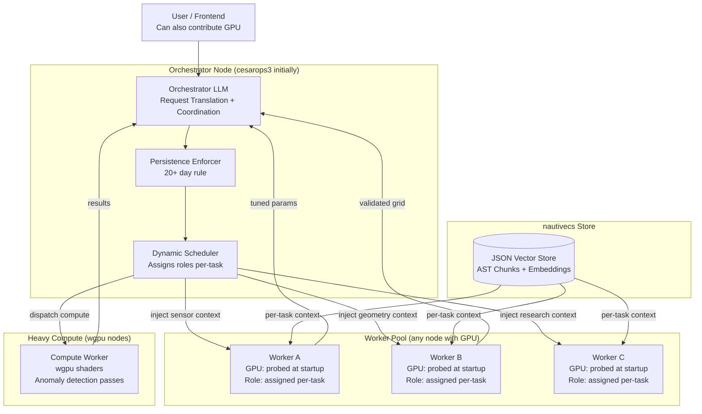
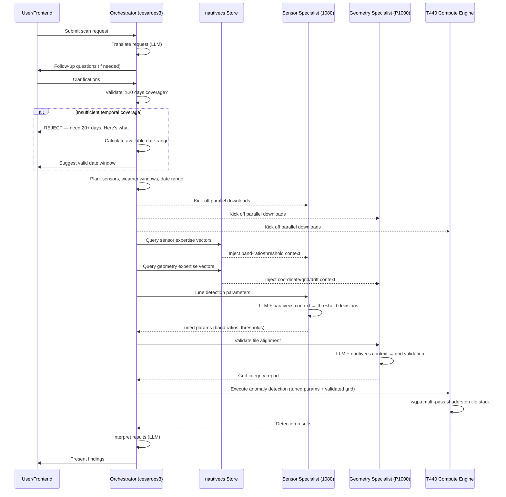
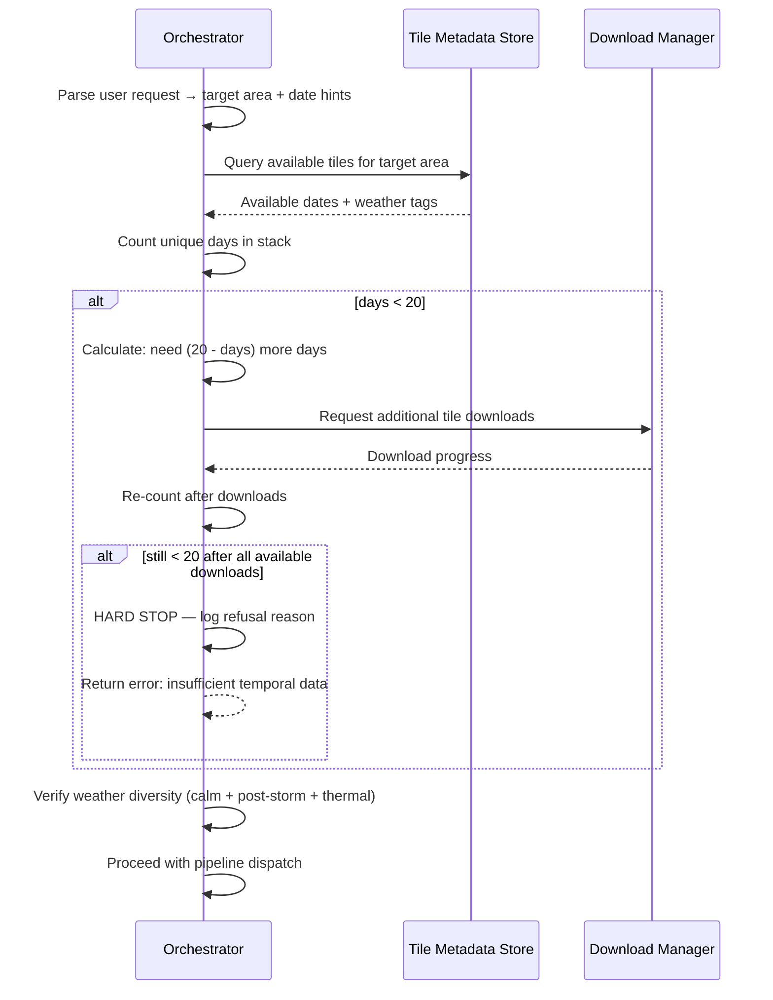

# Design Document: Distributed Orchestrator Pipeline with Vector-Steered GPU Workers

## Overview

This system implements a distributed orchestrator pipeline for the CESARops shipwreck detection platform. Nodes collaborate through a **dynamic role-assignment architecture**: any node running the worker binary can take on any role — the orchestrator assigns tasks based on available compute power at runtime, not fixed hardware assignments. Roles are defined by **nautivecs vector injection**, not by which GPU a node has.

The key innovation is **nautivecs vector injection**: rather than fine-tuning models or assigning permanent roles, each worker runs a generic LLM whose context window is dynamically populated with domain-specific code knowledge retrieved from the nautivecs semantic index. The same worker becomes a sensor threshold expert on one task and a geometry/QC specialist on the next — determined entirely by what context the orchestrator injects.

**Design principles:**
- **Dynamic role assignment**: Roles are injected, not hardcoded. Any GPU worker can do any specialist task.
- **Lose a node, don't lose the system**: If a node goes offline, the orchestrator redistributes work to remaining nodes (slower but functional).
- **Compute power discovery at startup**: Workers probe their own hardware (VRAM, compute capability, CPU cores) and register capabilities. The orchestrator makes scheduling decisions based on what's actually available.
- **Requester as compute**: Since wgpu/Vulkan runs anywhere, the frontend machine's GPU can be enlisted for lightweight passes if the cluster is overloaded. Same worker binary everywhere.
- **Per-task injection, not per-node**: The orchestrator decides "this task needs sensor expertise" and injects the right nautivecs context into whichever worker is free.

The orchestrator enforces the critical 20+ day temporal stacking requirement — previous implementations would shortcut to 1-2 days, which is useless for wreck detection. The orchestrator's persistence logic is a first-class concern, not an afterthought.

## Architecture



### Current Physical Mapping (adapts automatically)

| Node | Hardware | Typical Role | Can Also Do |
|------|----------|-------------|-------------|
| cesarops3 | GTX 1060 6GB | Orchestrator + overflow worker | Lightweight compute passes |
| cesarops2 | GTX 1080 8GB + P1000 4GB | 2 workers (one per GPU) | Heavy compute if T440 offline |
| T440 | 2× P100 32GB HBM2 | Primary compute engine | Worker tasks when compute idle |
| Requester | Any Vulkan GPU | Frontend | Enlisted for overflow compute |

**If T440 goes offline**: orchestrator reassigns compute to 1080 (reduced tile count, more slicing needed).
**If cesarops2 goes offline**: orchestrator uses 1060 as sole worker + T440 handles everything else.
**If cesarops3 goes offline**: any other node can run the orchestrator binary (it's the same codebase).
```

## Sequence Diagrams

### Main Pipeline Flow



### Orchestrator Persistence Enforcement



## Components and Interfaces

### Component 1: Orchestrator Service (`orchestrator`)

**Purpose**: Translates user requests, enforces scan strategy rules, coordinates the distributed pipeline, times worker tasks, and interprets results.

**Interface**:
```rust
/// The orchestrator's public API — runs on cesarops3.
#[async_trait]
pub trait Orchestrator: Send + Sync {
    /// Accept a user scan request, validate it, and return a pipeline handle.
    async fn submit_request(&self, req: ScanRequest) -> Result<PipelineHandle>;
    
    /// Check pipeline status by handle.
    async fn pipeline_status(&self, handle: &PipelineHandle) -> PipelineStatus;
    
    /// Cancel a running pipeline.
    async fn cancel_pipeline(&self, handle: &PipelineHandle) -> Result<()>;
    
    /// Get the orchestrator's current view of cluster health.
    async fn cluster_health(&self) -> ClusterHealth;
}

/// Internal orchestrator logic — not exposed over the network.
#[async_trait]
trait OrchestratorInternal {
    /// Translate a raw user request into structured scan parameters via LLM.
    async fn translate_request(&self, raw: &str) -> Result<ScanParameters>;
    
    /// Enforce the 20+ day temporal stacking requirement. Returns Err if
    /// insufficient data is available and cannot be downloaded.
    async fn enforce_temporal_coverage(&self, params: &ScanParameters) -> Result<TemporalStack>;
    
    /// Dispatch work to knob-turner specialists on cesarops2.
    async fn dispatch_to_specialists(&self, stack: &TemporalStack, params: &ScanParameters) -> Result<SpecialistResults>;
    
    /// Dispatch compute work to T440 P100s.
    async fn dispatch_compute(&self, work: ComputeWorkPackage) -> Result<Vec<PassResult>>;
    
    /// Interpret raw detection results via LLM for user presentation.
    async fn interpret_results(&self, results: &[PassResult]) -> Result<ScanReport>;
}
```

**Responsibilities**:
- User request translation via local LLM (Qwen3-8B)
- Hard enforcement of 20+ day temporal stacking rule
- Weather window classification for each tile
- Task timing and deadline enforcement
- Worker health monitoring
- Result interpretation and presentation
- Overflow: assist as knob-turner when orchestration is idle

### Component 2: Worker Service (`worker`)

**Purpose**: Runs on each specialist GPU, accepts work dispatches from the orchestrator, injects nautivecs context, and returns tuned parameters or validation results.

**Interface**:
```rust
/// A specialist worker that runs a permanently-loaded LLM with nautivecs injection.
#[async_trait]
pub trait Worker: Send + Sync {
    /// Report this worker's capabilities and current status.
    async fn status(&self) -> WorkerStatus;
    
    /// Accept a task dispatch from the orchestrator.
    async fn dispatch(&self, task: WorkerTask) -> Result<WorkerResult>;
    
    /// Inject fresh nautivecs context for the next inference cycle.
    async fn inject_context(&self, context: InjectedContext) -> Result<()>;
    
    /// Health check — returns latency and model readiness.
    async fn health_check(&self) -> HealthResponse;
}

/// Sensor Specialist interface (GTX 1080, 7B model).
#[async_trait]
pub trait SensorSpecialist: Worker {
    /// Given a tile stack and weather metadata, determine optimal detection thresholds.
    async fn tune_thresholds(&self, stack_meta: &StackMetadata) -> Result<DetectionThresholds>;
    
    /// Evaluate band ratios for a specific sensor type (Sentinel-2, Landsat 8/9).
    async fn evaluate_band_ratios(&self, sensor: SensorType, bands: &[BandInfo]) -> Result<BandRatioConfig>;
}

/// Geometry/QC Specialist interface (P1000, 3B model).
#[async_trait]
pub trait GeometrySpecialist: Worker {
    /// Validate tile alignment across the temporal stack.
    async fn validate_alignment(&self, tiles: &[TileMetadata]) -> Result<AlignmentReport>;
    
    /// Check sub-pixel grid integrity and drift correction.
    async fn validate_grid(&self, grid: &SubPixelGrid) -> Result<GridIntegrityReport>;
    
    /// Verify coordinate system consistency across multi-sensor stack.
    async fn verify_coordinates(&self, stack: &TemporalStack) -> Result<CoordinateReport>;
}
```

**Responsibilities**:
- Permanent model hosting (no swapping)
- nautivecs context injection before each inference
- Domain-specific parameter tuning
- Validation and quality control
- Heartbeat reporting to orchestrator

### Component 3: Compute Engine (`compute-engine`)

**Purpose**: Pure wgpu/WGSL compute on T440's dual P100s. No LLM during active processing. Executes multi-pass anomaly detection across the full tile stack.

**Interface**:
```rust
/// The T440 compute engine — pure GPU math, no LLM.
#[async_trait]
pub trait ComputeEngine: Send + Sync {
    /// Execute a full multi-pass anomaly detection pipeline.
    async fn execute_pipeline(&self, work: ComputeWorkPackage) -> Result<Vec<PassResult>>;
    
    /// Execute a single detection pass (scout, tiling, analyst, stitch).
    async fn execute_pass(&self, pass: ComputePass) -> Result<PassResult>;
    
    /// Report GPU utilization and memory state.
    async fn gpu_status(&self) -> GpuStatus;
    
    /// Load a WGSL shader module for a specific pass type.
    async fn load_shader(&self, pass_type: PassType, shader_source: &str) -> Result<ShaderHandle>;
}
```

**Responsibilities**:
- wgpu device management (dual P100 allocation)
- WGSL shader compilation and dispatch
- Tile I/O (managed by Dual Xeon Silvers)
- Sub-pixel grid management
- Multi-pass anomaly detection execution
- Result serialization back to orchestrator

### Component 4: Transport Layer (`transport`)

**Purpose**: Handles all inter-node communication over Tailscale mesh network.

**Interface**:
```rust
/// Transport abstraction for inter-node RPC.
#[async_trait]
pub trait Transport: Send + Sync {
    /// Send a task to a specific node and await the response.
    async fn call(&self, node: &NodeAddress, request: RpcRequest) -> Result<RpcResponse>;
    
    /// Send a task without waiting for response (fire-and-forget for downloads).
    async fn notify(&self, node: &NodeAddress, request: RpcRequest) -> Result<()>;
    
    /// Stream results back from a long-running compute task.
    async fn stream(&self, node: &NodeAddress, request: RpcRequest) -> Result<ResultStream>;
    
    /// Register this node's endpoint for discovery.
    async fn register(&self, capabilities: &NodeCapabilities) -> Result<()>;
}
```

**Responsibilities**:
- HTTP/2 or gRPC over Tailscale IPs
- Connection pooling and retry logic
- Timeout enforcement per task type
- mDNS + Tailscale peer discovery (existing `sovereign-cloud/src/discovery.rs`)

## Data Models

### Core Types

```rust
use chrono::{DateTime, Utc};
use serde::{Deserialize, Serialize};
use uuid::Uuid;

/// A user's scan request as received from the frontend.
#[derive(Debug, Clone, Serialize, Deserialize)]
pub struct ScanRequest {
    pub id: Uuid,
    pub raw_text: String,
    pub target_area: Option<GeoRegion>,
    pub date_range: Option<DateRange>,
    pub priority: Priority,
    pub submitted_at: DateTime<Utc>,
}

/// Structured scan parameters after orchestrator translation.
#[derive(Debug, Clone, Serialize, Deserialize)]
pub struct ScanParameters {
    pub request_id: Uuid,
    pub target_area: GeoRegion,
    pub date_range: DateRange,
    pub sensors: Vec<SensorType>,
    pub weather_windows: Vec<WeatherWindow>,
    pub min_temporal_days: u32,  // MUST be >= 20
    pub cloud_cover_max_pct: f32,  // Default 30%
    pub post_storm_weight: f32,  // Default 3.0
}

/// Geographic region of interest.
#[derive(Debug, Clone, Serialize, Deserialize)]
pub struct GeoRegion {
    pub center_lat: f64,
    pub center_lon: f64,
    pub radius_km: f64,
    pub name: Option<String>,
}

/// Date range for temporal stacking.
#[derive(Debug, Clone, Serialize, Deserialize)]
pub struct DateRange {
    pub start: DateTime<Utc>,
    pub end: DateTime<Utc>,
}

impl DateRange {
    /// Returns the number of days spanned.
    pub fn days(&self) -> i64 {
        (self.end - self.start).num_days()
    }
    
    /// Validates the 20+ day minimum requirement.
    pub fn meets_minimum(&self) -> bool {
        self.days() >= 20
    }
}

/// Weather window classification per scan-strategy.md.
#[derive(Debug, Clone, Serialize, Deserialize, PartialEq)]
pub enum WeatherWindow {
    Calm,
    PostStorm { days_since: u8 },  // 1-3
    LowWater { departure_ft: f32 },
    ThermalContrast { delta_c: f32 },
    SarTexture,
}

/// Sensor types supported by the pipeline.
#[derive(Debug, Clone, Serialize, Deserialize, PartialEq)]
pub enum SensorType {
    Sentinel2,
    Landsat8,
    Landsat9,
    Sentinel1Sar,
    Ecostress,
    IceSat2,
    Swot,
}

/// A tile in the temporal stack with weather metadata.
#[derive(Debug, Clone, Serialize, Deserialize)]
pub struct StackedTile {
    pub tile_id: String,
    pub acquisition_date: DateTime<Utc>,
    pub sensor: SensorType,
    pub weather: WeatherWindow,
    pub cloud_cover_pct: f32,
    pub weight: f32,  // post-storm day 1 = 3.0, calm = 1.0, transitional = 0.5
    pub bands: Vec<BandData>,
    pub noaa_buoy_crossref: Option<BuoyCrossRef>,
}

/// The validated temporal stack ready for compute dispatch.
#[derive(Debug, Clone, Serialize, Deserialize)]
pub struct TemporalStack {
    pub stack_id: Uuid,
    pub region: GeoRegion,
    pub tiles: Vec<StackedTile>,
    pub unique_days: u32,
    pub weather_diversity: WeatherDiversity,
    pub validated_at: DateTime<Utc>,
}

/// Ensures weather diversity in the stack.
#[derive(Debug, Clone, Serialize, Deserialize)]
pub struct WeatherDiversity {
    pub has_calm: bool,
    pub has_post_storm: bool,
    pub has_thermal: bool,
    pub has_sar: bool,
    pub diversity_score: f32,  // 0.0-1.0
}

/// Detection thresholds tuned by the Sensor Specialist.
#[derive(Debug, Clone, Serialize, Deserialize)]
pub struct DetectionThresholds {
    pub glint_threshold: f32,
    pub hydrocarbon_threshold: f32,
    pub thermal_anomaly_threshold: f32,
    pub band_ratios: Vec<BandRatioConfig>,
    pub confidence_floor: f32,
    pub tuning_rationale: String,  // LLM explanation of why these values
}

/// Band ratio configuration for a specific sensor.
#[derive(Debug, Clone, Serialize, Deserialize)]
pub struct BandRatioConfig {
    pub sensor: SensorType,
    pub numerator_band: u8,
    pub denominator_band: u8,
    pub threshold: f32,
    pub description: String,
}

/// Work package sent to T440 compute engine.
#[derive(Debug, Clone, Serialize, Deserialize)]
pub struct ComputeWorkPackage {
    pub package_id: Uuid,
    pub stack: TemporalStack,
    pub thresholds: DetectionThresholds,
    pub grid_config: SubPixelGrid,
    pub passes: Vec<PassType>,
}

/// Types of compute passes.
#[derive(Debug, Clone, Serialize, Deserialize, PartialEq)]
pub enum PassType {
    Scout,
    SyntheticTiling,
    Analyst,
    TemporalStitch,
}

/// Sub-pixel grid configuration validated by Geometry Specialist.
#[derive(Debug, Clone, Serialize, Deserialize)]
pub struct SubPixelGrid {
    pub resolution_m: f64,
    pub origin_lat: f64,
    pub origin_lon: f64,
    pub width_cells: u32,
    pub height_cells: u32,
    pub drift_correction: DriftCorrection,
}

/// Drift correction parameters.
#[derive(Debug, Clone, Serialize, Deserialize)]
pub struct DriftCorrection {
    pub dx_pixels: f64,
    pub dy_pixels: f64,
    pub rotation_rad: f64,
    pub confidence: f32,
}

/// Pipeline execution handle returned to the user.
#[derive(Debug, Clone, Serialize, Deserialize)]
pub struct PipelineHandle {
    pub id: Uuid,
    pub request_id: Uuid,
    pub created_at: DateTime<Utc>,
    pub estimated_duration_secs: u64,
}

/// Pipeline execution status.
#[derive(Debug, Clone, Serialize, Deserialize)]
pub enum PipelineStatus {
    Queued,
    Translating,
    EnforcingTemporal,
    DownloadingTiles,
    TuningParameters,
    ValidatingGeometry,
    Computing { pass: PassType, progress_pct: f32 },
    Interpreting,
    Complete { report: ScanReport },
    Failed { reason: String, stage: String },
}

/// Final scan report presented to the user.
#[derive(Debug, Clone, Serialize, Deserialize)]
pub struct ScanReport {
    pub pipeline_id: Uuid,
    pub anomalies: Vec<AnomalyResult>,
    pub summary: String,  // LLM-generated interpretation
    pub temporal_coverage: TemporalCoverageStats,
    pub elapsed_secs: u64,
}

/// A detected anomaly with confidence and provenance.
#[derive(Debug, Clone, Serialize, Deserialize)]
pub struct AnomalyResult {
    pub lat: f64,
    pub lon: f64,
    pub confidence: f32,
    pub detection_source: WeatherWindow,
    pub pass_results: Vec<PassResult>,
    pub interpretation: String,
}

**Validation Rules**:
- `ScanParameters.min_temporal_days` MUST be >= 20 (hard-coded, not configurable by user)
- `StackedTile.cloud_cover_pct` must be <= 30% for optical sensors (SAR exempt)
- `TemporalStack.unique_days` must equal or exceed `ScanParameters.min_temporal_days`
- `WeatherDiversity` must have at least 2 of 4 categories present
- `DetectionThresholds` values must be in [0.0, 1.0] range
- `SubPixelGrid.drift_correction.confidence` must be >= 0.8 before compute dispatch

## Algorithmic Pseudocode

### Orchestrator Persistence Algorithm

```rust
/// The core persistence enforcement algorithm.
/// This is the CRITICAL path that prevents the system from shortcutting
/// to insufficient temporal coverage.
///
/// INVARIANT: This function NEVER returns Ok if unique_days < 20.
async fn enforce_temporal_coverage(
    &self,
    params: &ScanParameters,
    tile_store: &dyn TileStore,
    downloader: &dyn TileDownloader,
) -> Result<TemporalStack> {
    // Phase 1: Check existing tile inventory
    let existing_tiles = tile_store
        .query_region(&params.target_area, &params.date_range)
        .await?;
    
    let unique_days = count_unique_days(&existing_tiles);
    
    if unique_days >= params.min_temporal_days {
        // Already have enough — validate weather diversity and return
        let stack = build_validated_stack(existing_tiles, params)?;
        assert!(stack.unique_days >= 20, "INVARIANT VIOLATION: stack has < 20 days");
        return Ok(stack);
    }
    
    // Phase 2: Attempt to download missing days
    let days_needed = params.min_temporal_days - unique_days;
    let available_dates = downloader
        .query_available_dates(&params.target_area, &params.date_range, &params.sensors)
        .await?;
    
    let downloadable_days = available_dates
        .iter()
        .filter(|d| !existing_tiles.iter().any(|t| same_day(&t.acquisition_date, d)))
        .count() as u32;
    
    if unique_days + downloadable_days < params.min_temporal_days {
        // HARD STOP: Even with all available downloads, we can't reach 20 days.
        // This is NOT a soft warning — it's a pipeline rejection.
        return Err(anyhow::anyhow!(
            "TEMPORAL COVERAGE INSUFFICIENT: Have {} days, can download {} more, \
             need {} total. Target area may not have enough satellite coverage \
             in the requested date range. Suggest expanding date range to {} days.",
            unique_days,
            downloadable_days,
            params.min_temporal_days,
            estimate_required_range(params)
        ));
    }
    
    // Phase 3: Download missing tiles (parallel across all nodes)
    let download_tasks: Vec<_> = available_dates
        .into_iter()
        .filter(|d| !existing_tiles.iter().any(|t| same_day(&t.acquisition_date, d)))
        .take(days_needed as usize)
        .map(|date| downloader.download_tile(&params.target_area, &date, &params.sensors))
        .collect();
    
    let new_tiles = futures::future::join_all(download_tasks)
        .await
        .into_iter()
        .filter_map(|r| r.ok())
        .collect::<Vec<_>>();
    
    // Phase 4: Re-validate with new tiles
    let all_tiles: Vec<_> = existing_tiles.into_iter().chain(new_tiles).collect();
    let final_days = count_unique_days(&all_tiles);
    
    if final_days < params.min_temporal_days {
        return Err(anyhow::anyhow!(
            "TEMPORAL COVERAGE STILL INSUFFICIENT after downloads: {} days (need {}). \
             Some downloads may have failed or been rejected for cloud cover.",
            final_days,
            params.min_temporal_days
        ));
    }
    
    let stack = build_validated_stack(all_tiles, params)?;
    assert!(stack.unique_days >= 20, "INVARIANT VIOLATION: stack has < 20 days");
    Ok(stack)
}
```

**Preconditions:**
- `params.min_temporal_days >= 20` (enforced at construction)
- `params.target_area` is a valid geographic region
- `params.date_range` spans at least 20 calendar days
- Network connectivity to tile download endpoints

**Postconditions:**
- Returns `Ok(stack)` ONLY if `stack.unique_days >= 20`
- Returns `Err` with actionable message if coverage is impossible
- All tiles in the stack have `cloud_cover_pct <= params.cloud_cover_max_pct` (optical only)
- Weather tags are assigned to every tile via NOAA buoy cross-reference

**Loop Invariants:**
- At no point does the algorithm proceed to compute dispatch with < 20 days
- The `assert!` at the end is a defense-in-depth check, not the primary enforcement

### nautivecs Context Injection Algorithm

```rust
/// Inject domain expertise into a worker's LLM context window.
/// This is what transforms a generic 7B model into a specialist.
async fn inject_specialist_context(
    engine: &NautivecsEngine,
    worker_role: WorkerRole,
    task_context: &TaskContext,
) -> Result<InjectedContext> {
    // Step 1: Determine query terms based on worker role
    let queries = match worker_role {
        WorkerRole::SensorSpecialist => vec![
            "band ratio threshold detection sentinel landsat",
            "glint hydrocarbon thermal anomaly detection",
            "cloud cover rejection weather window classification",
            "NDWI MNDWI FAI spectral index calculation",
        ],
        WorkerRole::GeometrySpecialist => vec![
            "sub-pixel grid alignment drift correction",
            "coordinate system UTM WGS84 transformation",
            "tile registration cross-correlation",
            "synthetic grid density interpolation",
        ],
    };
    
    // Step 2: Query nautivecs for each domain area
    let mut all_fragments: Vec<ContextFragment> = Vec::new();
    for query in &queries {
        let results = engine.query(query, 3).await?;
        let fragments: Vec<ContextFragment> = results.iter()
            .map(ContextFragment::from)
            .collect();
        all_fragments.extend(fragments);
    }
    
    // Step 3: Add task-specific context (current tile metadata, sensor info)
    let task_fragment = ContextFragment {
        text: format_task_context(task_context),
        file_path: "runtime/current_task".to_string(),
        function_name: "task_context".to_string(),
        line_start: 0,
        line_end: 0,
        search_score: 1.0,  // Highest priority
    };
    all_fragments.insert(0, task_fragment);
    
    // Step 4: Build the injection payload within token budget
    let budget = match worker_role {
        WorkerRole::SensorSpecialist => 4096,  // 7B model has more context room
        WorkerRole::GeometrySpecialist => 2048,  // 3B model — tighter budget
    };
    
    let builder = InjectedContextBuilder::new(budget, true);
    let system_context = builder.build_system_context(&all_fragments);
    
    Ok(InjectedContext {
        system_prompt_addition: system_context,
        role: worker_role,
        fragment_count: all_fragments.len(),
        injected_at: Utc::now(),
    })
}
```

**Preconditions:**
- nautivecs store has been indexed with relevant codebase (sensor code, geometry code)
- Worker's LLM is loaded and ready to accept system prompt modifications
- `task_context` contains the current tile stack metadata

**Postconditions:**
- Returns an `InjectedContext` that fits within the worker's token budget
- Context is ordered by relevance (task-specific first, then domain knowledge)
- The worker's next inference will use this context for decision-making

**Loop Invariants:**
- Total injected tokens never exceed the budget for the target model size
- Each fragment retains its source attribution (file path, function name)

### Worker Threshold Tuning Algorithm

```rust
/// Sensor Specialist: determine optimal detection thresholds for the current stack.
/// Uses nautivecs-injected expertise to make informed decisions.
async fn tune_thresholds(
    &self,
    stack_meta: &StackMetadata,
    injected_context: &InjectedContext,
) -> Result<DetectionThresholds> {
    // Build the prompt with injected expertise
    let prompt = format!(
        "{}\n\n\
        ## Current Task\n\
        Analyze this tile stack and determine optimal detection thresholds:\n\
        - Sensor: {:?}\n\
        - Tile count: {}\n\
        - Weather mix: {:?}\n\
        - Depth range: {:.1}m - {:.1}m\n\
        - Water clarity (estimated): {:?}\n\n\
        Provide thresholds as JSON with rationale for each value.\n\
        Consider: post-storm tiles need LOWER thresholds (more sensitive),\n\
        calm tiles need HIGHER thresholds (more selective).",
        injected_context.system_prompt_addition,
        stack_meta.primary_sensor,
        stack_meta.tile_count,
        stack_meta.weather_distribution,
        stack_meta.min_depth_m,
        stack_meta.max_depth_m,
        stack_meta.water_clarity,
    );
    
    // Inference via the permanently-loaded 7B model
    let response = self.llm_client.complete(&prompt).await?;
    
    // Parse structured output from LLM
    let thresholds = parse_threshold_response(&response)?;
    
    // Sanity bounds — LLM can hallucinate extreme values
    validate_threshold_bounds(&thresholds)?;
    
    Ok(thresholds)
}

/// Validate that LLM-generated thresholds are within sane bounds.
fn validate_threshold_bounds(t: &DetectionThresholds) -> Result<()> {
    ensure!(t.glint_threshold >= 0.05 && t.glint_threshold <= 0.95,
        "Glint threshold {:.3} out of sane range [0.05, 0.95]", t.glint_threshold);
    ensure!(t.hydrocarbon_threshold >= 0.05 && t.hydrocarbon_threshold <= 0.95,
        "Hydrocarbon threshold {:.3} out of sane range", t.hydrocarbon_threshold);
    ensure!(t.thermal_anomaly_threshold >= 0.05 && t.thermal_anomaly_threshold <= 0.95,
        "Thermal threshold {:.3} out of sane range", t.thermal_anomaly_threshold);
    ensure!(t.confidence_floor >= 0.1 && t.confidence_floor <= 0.9,
        "Confidence floor {:.3} out of sane range [0.1, 0.9]", t.confidence_floor);
    Ok(())
}
```

**Preconditions:**
- Worker has a loaded 7B model (Qwen3-8B Q4_K_M or similar)
- nautivecs context has been injected for this task
- `stack_meta` contains accurate tile metadata

**Postconditions:**
- All threshold values are in [0.05, 0.95] range
- `confidence_floor` is in [0.1, 0.9] range
- `tuning_rationale` explains the LLM's reasoning
- Thresholds are appropriate for the weather mix in the stack

## Key Functions with Formal Specifications

### Function: `count_unique_days`

```rust
fn count_unique_days(tiles: &[StackedTile]) -> u32
```

**Preconditions:**
- `tiles` may be empty (returns 0)
- Each tile has a valid `acquisition_date`

**Postconditions:**
- Returns the count of distinct calendar days (UTC) across all tiles
- Two tiles on the same UTC day count as 1 unique day
- Result is always <= tiles.len()

**Loop Invariants:**
- The set of seen dates grows monotonically
- No date is counted twice

### Function: `build_validated_stack`

```rust
fn build_validated_stack(tiles: Vec<StackedTile>, params: &ScanParameters) -> Result<TemporalStack>
```

**Preconditions:**
- `tiles` contains at least 20 unique days of data
- `params.cloud_cover_max_pct` is in [0.0, 100.0]

**Postconditions:**
- All optical tiles have `cloud_cover_pct <= params.cloud_cover_max_pct`
- SAR tiles are never rejected for cloud cover
- Each tile has a `weight` assigned based on its `WeatherWindow`
- `WeatherDiversity` is computed from the final tile set
- Returns `Err` if filtering reduces unique days below 20

### Function: `dispatch_to_specialists`

```rust
async fn dispatch_to_specialists(
    &self,
    stack: &TemporalStack,
    params: &ScanParameters,
) -> Result<SpecialistResults>
```

**Preconditions:**
- Both specialist workers are healthy (health_check passed within last 30s)
- nautivecs store is indexed and queryable
- `stack` has been validated (unique_days >= 20)

**Postconditions:**
- `SpecialistResults` contains both `DetectionThresholds` and `GridIntegrityReport`
- If either specialist fails, the function retries once before returning Err
- Total wall-clock time is bounded by `SPECIALIST_TIMEOUT_SECS` (default: 120)

**Loop Invariants:** N/A (parallel dispatch, not iterative)

### Function: `execute_pipeline` (T440 Compute)

```rust
async fn execute_pipeline(&self, work: ComputeWorkPackage) -> Result<Vec<PassResult>>
```

**Preconditions:**
- At least one P100 GPU has sufficient free VRAM (>= 4GB for shader buffers)
- `work.stack` has >= 20 unique days
- `work.thresholds` has been validated (all values in bounds)
- `work.grid_config.drift_correction.confidence >= 0.8`

**Postconditions:**
- Returns one `PassResult` per pass in `work.passes`
- Each `PassResult.anomaly_confidence` is in [0.0, 1.0]
- GPU memory is fully released after completion
- Total execution time is logged for orchestrator timing

## Example Usage

```rust
use distributed_orchestrator::{
    Orchestrator, OrchestratorConfig, ScanRequest, GeoRegion, Priority,
};
use uuid::Uuid;
use chrono::Utc;

#[tokio::main]
async fn main() -> anyhow::Result<()> {
    // Initialize the orchestrator on cesarops3
    let config = OrchestratorConfig {
        llm_endpoint: "http://localhost:5001/v1".to_string(),  // Local KoboldCPP
        llm_model: "qwen3-8b-q4_k_m".to_string(),
        nautivecs_db: "./data/nautivecs_store.json".to_string(),
        sensor_worker: NodeAddress::tailscale("100.102.158.111", 8765),
        geometry_worker: NodeAddress::tailscale("100.102.158.111", 8766),
        compute_engine: NodeAddress::tailscale("100.72.182.77", 9000),
        min_temporal_days: 20,  // HARD MINIMUM — never reduce this
        specialist_timeout_secs: 120,
        compute_timeout_secs: 600,
    };
    
    let orchestrator = Orchestrator::new(config).await?;
    
    // Submit a scan request
    let request = ScanRequest {
        id: Uuid::new_v4(),
        raw_text: "Check the area around 42.5°N 81.7°W for potential wrecks. \
                   Focus on post-storm imagery from September 2024.".to_string(),
        target_area: Some(GeoRegion {
            center_lat: 42.5,
            center_lon: -81.7,
            radius_km: 5.0,
            name: Some("Lake Erie - Point Pelee region".to_string()),
        }),
        date_range: None,  // Orchestrator will determine based on 20+ day rule
        priority: Priority::Normal,
        submitted_at: Utc::now(),
    };
    
    let handle = orchestrator.submit_request(request).await?;
    println!("Pipeline started: {:?}", handle.id);
    
    // Poll for completion
    loop {
        let status = orchestrator.pipeline_status(&handle).await;
        match status {
            PipelineStatus::Complete { report } => {
                println!("Scan complete! Found {} anomalies", report.anomalies.len());
                println!("Summary: {}", report.summary);
                break;
            }
            PipelineStatus::Failed { reason, stage } => {
                eprintln!("Pipeline failed at {}: {}", stage, reason);
                break;
            }
            other => {
                println!("Status: {:?}", other);
                tokio::time::sleep(tokio::time::Duration::from_secs(5)).await;
            }
        }
    }
    
    Ok(())
}
```

### Worker Initialization Example

```rust
use distributed_orchestrator::worker::{
    SensorWorkerConfig, SensorWorkerService, WorkerRole,
};
use nautivecs::{Config as NautivecsConfig, NautivecsEngine};

/// Start the Sensor Specialist worker on cesarops2 (GTX 1080).
#[tokio::main]
async fn main() -> anyhow::Result<()> {
    // Initialize nautivecs for context injection
    let nv_config = NautivecsConfig::builder()
        .embedding_endpoint("https://llm.cesarops.org/v1")
        .db_path("./data/nautivecs_store.json")
        .vector_dimensions(768)
        .build();
    
    let engine = NautivecsEngine::init(nv_config).await?;
    
    // Configure the worker
    let worker_config = SensorWorkerConfig {
        role: WorkerRole::SensorSpecialist,
        llm_endpoint: "http://localhost:5001/v1".to_string(),  // Local model on 1080
        llm_model: "qwen3-8b-q4_k_m".to_string(),
        listen_port: 8765,
        gpu_device: "GTX 1080".to_string(),
        vram_gb: 8,
        nautivecs_engine: engine,
    };
    
    let service = SensorWorkerService::new(worker_config).await?;
    
    // Register with orchestrator via mDNS
    service.announce().await?;
    
    // Start serving — blocks forever
    service.serve().await?;
    
    Ok(())
}
```

## Correctness Properties

*A property is a characteristic or behavior that should hold true across all valid executions of a system — essentially, a formal statement about what the system should do. Properties serve as the bridge between human-readable specifications and machine-verifiable correctness guarantees.*

### Property 1: Temporal coverage invariant

*For any* TemporalStack that passes validation (returned as Ok from `enforce_temporal_coverage` or `build_validated_stack`), the `unique_days` field SHALL be at least 20. No code path may produce a valid stack with fewer than 20 unique calendar days.

**Validates: Requirements 1.1, 1.4, 12.2**

### Property 2: Unique day counting correctness

*For any* collection of StackedTiles, `count_unique_days` SHALL return a value equal to the cardinality of the set of distinct UTC calendar dates derived from the tiles' `acquisition_date` fields. Two tiles on the same UTC day (regardless of time-of-day or sensor type) count as one.

**Validates: Requirements 1.5, 11.1, 11.2**

### Property 3: Unique day count bounded by collection size

*For any* collection of StackedTiles, `count_unique_days` SHALL return a value less than or equal to the number of tiles in the input, and greater than or equal to zero (returning zero for empty input).

**Validates: Requirements 11.3, 11.4**

### Property 4: Cloud cover filtering with SAR exemption

*For any* TemporalStack produced by `build_validated_stack`, all optical sensor tiles (Sentinel-2, Landsat 8, Landsat 9) SHALL have `cloud_cover_pct` at most equal to the configured maximum (default 30%), while SAR tiles (Sentinel-1) SHALL never be filtered regardless of their cloud cover value.

**Validates: Requirements 2.1, 2.2, 12.1**

### Property 5: Weather weight determinism

*For any* tile in a validated TemporalStack, the `weight` field SHALL be deterministically assigned based on its `WeatherWindow` classification: PostStorm day-1 → 3.0, Calm → 1.0, transitional → 0.5. The same WeatherWindow always produces the same weight.

**Validates: Requirements 2.4, 12.4**

### Property 6: Weather diversity validation

*For any* valid TemporalStack, the `WeatherDiversity` struct SHALL accurately reflect the weather categories present in the final filtered tile set, and at least 2 of 4 categories (Calm, PostStorm, ThermalContrast, SarTexture) SHALL be present.

**Validates: Requirements 2.5, 12.3**

### Property 7: nautivecs injection respects token budget

*For any* set of ContextFragments returned by nautivecs queries, the `InjectedContextBuilder` SHALL produce a `system_prompt_addition` whose approximate token count never exceeds the configured budget (4096 for 7B models, 2048 for 3B models).

**Validates: Requirements 3.4**

### Property 8: nautivecs injection ordering

*For any* injection payload built by `InjectedContextBuilder`, task-specific context (the current task fragment with score 1.0) SHALL appear before domain knowledge fragments in the output string.

**Validates: Requirements 3.5**

### Property 9: Detection threshold bounds validation

*For any* DetectionThresholds struct that passes `validate_threshold_bounds`, the glint, hydrocarbon, and thermal anomaly thresholds SHALL be within [0.05, 0.95], and the confidence floor SHALL be within [0.1, 0.9]. Conversely, any struct with values outside these ranges SHALL be rejected.

**Validates: Requirements 4.1, 4.2**

### Property 10: Drift correction confidence gate

*For any* ComputeWorkPackage dispatched to the Compute_Engine, the `grid_config.drift_correction.confidence` value SHALL be at least 0.8. Any Drift_Correction with confidence below 0.8 SHALL cause compute dispatch to be rejected.

**Validates: Requirements 8.1, 8.2, 8.3**

### Property 11: Insufficient coverage rejection

*For any* combination of existing tile inventory and downloadable tiles where the total achievable unique day count is fewer than 20, `enforce_temporal_coverage` SHALL return an Err containing the current day count, maximum achievable count, and a suggested expanded date range.

**Validates: Requirements 1.3**

### Property 12: Transport timeout error structure

*For any* transport call that exceeds its configured timeout, the returned error SHALL contain the target node address, elapsed time, and task identifier.

**Validates: Requirements 7.4**

### Property 13: Pipeline failure records reason and stage

*For any* pipeline that transitions to Failed status, the PipelineStatus::Failed variant SHALL contain both a non-empty `reason` string and a non-empty `stage` string identifying where the failure occurred.

**Validates: Requirements 9.4**

## Error Handling

### Error Scenario 1: Insufficient Temporal Coverage

**Condition**: User requests a scan but fewer than 20 unique days of imagery exist for the target area, even after attempting all available downloads.

**Response**: Orchestrator returns a structured error with:
- Current day count
- Maximum achievable day count
- Suggested expanded date range that would satisfy the requirement
- List of available sensors for the target area

**Recovery**: User must either expand the date range or accept that the area has insufficient satellite coverage. The orchestrator NEVER proceeds with < 20 days.

### Error Scenario 2: Worker Unreachable

**Condition**: A specialist worker on cesarops2 fails health check or doesn't respond within timeout.

**Response**: 
- Orchestrator logs the failure with timestamp
- Retries once after 5-second backoff
- If still unreachable, checks if orchestrator can serve as overflow knob-turner
- If orchestrator is idle (no active translation), it loads the relevant nautivecs context and performs the specialist task itself

**Recovery**: Worker auto-reconnects via mDNS when it comes back online. Orchestrator resumes normal dispatch.

### Error Scenario 3: LLM Generates Invalid Thresholds

**Condition**: The Sensor Specialist's LLM outputs threshold values outside sane bounds (e.g., glint_threshold = 0.001 or 0.999).

**Response**:
- `validate_threshold_bounds()` catches the violation
- Worker retries inference with a more constrained prompt (adds explicit bounds to prompt)
- If second attempt also fails, falls back to conservative defaults (0.3 for all thresholds)
- Logs the failure for nautivecs index improvement

**Recovery**: Conservative defaults ensure the pipeline continues. The detection may be less optimal but won't produce garbage results.

### Error Scenario 4: T440 Compute Engine Offline

**Condition**: T440 is unreachable (e.g., network switch issue — current real-world state).

**Response**:
- Orchestrator detects via health check failure
- Pipeline enters `Queued` state for compute phase
- Orchestrator continues to accept and prepare new requests (translation, temporal validation, specialist tuning)
- When T440 comes back online (detected via periodic discovery), queued compute work is dispatched

**Recovery**: Automatic via the existing `spawn_periodic_discovery()` in `sovereign-cloud/src/discovery.rs`. No manual intervention needed.

### Error Scenario 5: nautivecs Store Corruption

**Condition**: The JSON vector store file is corrupted or missing.

**Response**:
- `NautivecsEngine::init()` returns an error
- Worker falls back to "unsteered" mode — LLM operates without injected context
- Orchestrator is notified that specialist quality may be degraded
- Background task re-indexes the codebase to rebuild the store

**Recovery**: Re-indexing is automatic. The worker continues to function (just less expertly) during rebuild.

## Testing Strategy

### Unit Testing Approach

- Test `enforce_temporal_coverage` with various tile counts (0, 10, 19, 20, 50)
- Test `count_unique_days` with duplicate dates, edge cases (midnight UTC boundary)
- Test `validate_threshold_bounds` with boundary values
- Test `build_validated_stack` with mixed cloud cover percentages
- Test weather weight assignment for all `WeatherWindow` variants
- Test `DateRange::meets_minimum()` with exactly 20 days, 19 days, 21 days

### Property-Based Testing Approach

**Property Test Library**: `proptest` (Rust)

Key properties to test with random inputs:
1. Any `TemporalStack` that passes validation has `unique_days >= 20`
2. Any `DetectionThresholds` that passes validation has all values in bounds
3. `count_unique_days` is always <= input length and >= 0
4. Weather weight assignment is deterministic (same input → same output)
5. nautivecs injection never exceeds token budget regardless of query results

### Integration Testing Approach

**Testable now (cesarops2 + cesarops3)**:
1. nautivecs injection reliability — index sensor code, inject into 7B model, verify threshold decisions are consistent across 10 runs
2. Orchestrator persistence — submit requests with < 20 days available, verify hard rejection
3. Worker health check round-trip over Tailscale
4. mDNS discovery between cesarops2 and cesarops3

**Testable later (when T440 is online)**:
5. Full pipeline end-to-end with real tile data
6. wgpu shader execution on P100s
7. Compute timeout enforcement
8. Multi-pass result aggregation

## Performance Considerations

- **LLM inference latency**: Qwen3-8B Q4_K_M on GTX 1060 (6GB) — expect ~15-30 tokens/sec for orchestrator translation. Budget 10-20 seconds per translation.
- **nautivecs query latency**: Hybrid search (vector + keyword) on JSON store — expect < 100ms for typical queries. The store is small (workspace-sized, not internet-scale).
- **Inter-node latency**: Tailscale mesh — expect 1-5ms RTT between nodes on same LAN, 10-50ms over WAN.
- **Tile download**: Bottlenecked by Earthdata/Copernicus API rate limits, not local compute. Parallel downloads across nodes help.
- **P100 compute**: Each pass (scout, tiling, analyst, stitch) should complete in < 30 seconds per tile. Full 20-tile stack: ~10 minutes for all 4 passes.
- **Memory pressure**: GTX 1060 (6GB) is tight for 8B Q4_K_M (~5GB). Monitor for OOM. P1000 (4GB) runs 3B model (~2.5GB) comfortably.

## Security Considerations

- All inter-node traffic flows over Tailscale (WireGuard encrypted)
- No secrets in RPC payloads — authentication is handled by Tailscale ACLs
- LLM endpoints are local (localhost or Tailscale IP) — never exposed to public internet
- nautivecs store contains code snippets only — no credentials or PII
- Earthdata/Copernicus tokens are sourced from environment variables, never transmitted between nodes

## Dependencies

| Crate | Purpose | Version |
|-------|---------|---------|
| `tokio` | Async runtime | 1.x |
| `axum` | HTTP server for worker/orchestrator APIs | 0.7.x |
| `reqwest` | HTTP client for inter-node RPC | 0.12.x |
| `serde` / `serde_json` | Serialization | 1.x |
| `uuid` | Request/pipeline IDs | 1.x |
| `chrono` | Timestamp handling | 0.4.x |
| `anyhow` | Error handling | 1.x |
| `tracing` | Structured logging | 0.1.x |
| `wgpu` | GPU compute (T440 only) | 29.x |
| `nautivecs` | Vector injection engine | 0.1.0 (workspace) |
| `mdns-sd` | Service discovery | existing |
| `proptest` | Property-based testing | 1.x |
| `futures` | Async combinators | 0.3.x |
