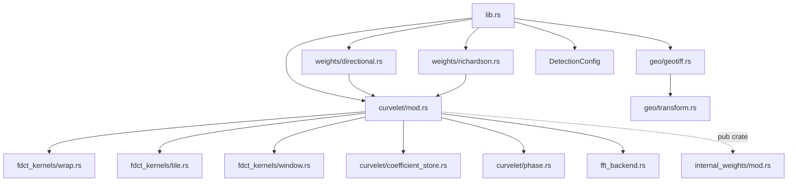
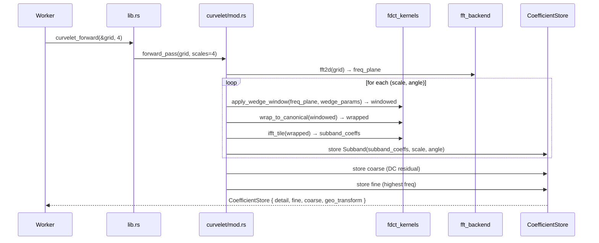

# Design Document: nauticuvs Precision Engine

## Overview

The `nauticuvs` precision engine is a foundational upgrade to the `nauticuvs` Rust crate — the
shared mathematical core consumed by `cesarops-aeromagnetic-worker`, `cesarops-satellite-worker`,
and `sovereign-cloud`. The upgrade delivers eight capabilities across three phases:

- **Phase 1 — Precision & Data Integrity**: compile-time f32/f64 precision selection, 64-byte
  SIMD-aligned `Subband` memory layout, and CRS-preserving GeoTIFF ingestion.
- **Phase 2 — Advancing the Math**: directional weighting via a `DirectionalMask` trait,
  Richardson Number thermal-physics weighting for SAR reconstruction, and complex-phase extraction
  from curvelet coefficients.
- **Phase 3 — Hardware & Safety**: XLA-compilable FDCT inner-loop module for TPU execution, and
  an opaque `internal_weights` module that hides wreck-signature detection parameters from the
  public crate surface.

The design is strictly additive: the existing `curvelet_forward(&Array2<f32>, 4)` call site in
`cesarops-aeromagnetic-worker` compiles and runs unchanged. All new capabilities are opt-in via
new types, traits, and feature flags.

### Research Summary

**Fast Discrete Curvelet Transform (FDCT) — wrapping variant:**
The standard reference implementation is CurveLab (Candès, Demanet, Donoho, Ying, 2006). The
wrapping variant operates in the frequency domain: (1) 2-D FFT of the input, (2) for each
(scale, angle) wedge, multiply by a smooth window function, (3) wrap the windowed spectrum to a
canonical rectangle, (4) 2-D IFFT of the wrapped rectangle to obtain the spatial-domain subband
coefficients. The inverse pass reverses these steps with adjoint operations.

**FFT backends in Rust:**
- `rustfft` (v6.x) — pure Rust, supports `f32` and `f64` via the `FftNum` trait. Zero unsafe,
  no C dependencies. Suitable as the default backend.
- `fftw` (v0.8.x) — Rust bindings to FFTW3. Faster for large transforms on CPU but requires a C
  toolchain and FFTW3 shared library. Selected via `fftw` Cargo feature.

**SIMD alignment in Rust:**
`std::alloc::Layout::from_size_align` with align=64 gives a 64-byte aligned allocation. The
`aligned-vec` crate (v0.5) wraps this in a safe `Vec`-like API. Alternatively, `bytemuck` +
manual `GlobalAlloc` works but is more complex. We use `aligned-vec` for `Subband` storage.

**GeoTIFF parsing in pure Rust:**
`tiff` crate (v0.9) reads TIFF/GeoTIFF files and exposes IFD tags. GeoTransform is stored in
GeoTIFF tags 33922 (ModelTiepointTag) and 33550 (ModelPixelScaleTag), or tag 34264
(ModelTransformationTag). The `proj` crate (v0.27, wrapping PROJ 9.x) handles CRS reprojection.
For the `gdal-support` feature, `gdal` crate (v0.16) wraps GDAL's GeoTIFF reader directly.

**XLA in Rust:**
The `xla` crate (v0.0.x, Google) provides `#[xla::kernel]` proc-macro for marking pure functions
as XLA-compilable. The macro is a no-op when the `xla` feature is inactive, so the same source
compiles on both CPU and TPU paths.

**Property-based testing in Rust:**
`proptest` (v1.x) is the standard choice. It provides `prop_compose!`, `Strategy`, and
`proptest!` macros. Minimum iterations are configured via `ProptestConfig::with_cases(100)`.


---

## Architecture

The precision engine is implemented entirely within the `nauticuvs` crate. No new crates are
introduced. The architecture separates concerns into five layers:

```
┌─────────────────────────────────────────────────────────────────────┐
│                        Public API Layer                             │
│  curvelet_forward()  GeoTiffInput  DirectionalMask  DetectionConfig │
└────────────────────────────┬────────────────────────────────────────┘
                             │
┌────────────────────────────▼────────────────────────────────────────┐
│                      Transform Layer                                │
│   curvelet/mod.rs — orchestrates forward/inverse passes             │
│   curvelet/coefficient_store.rs — CoefficientStore, Subband         │
│   curvelet/phase.rs — phase_map, amplitude_map, phase_coherence     │
└────────────────────────────┬────────────────────────────────────────┘
                             │
┌────────────────────────────▼────────────────────────────────────────┐
│                      Kernel Layer (fdct_kernels)                    │
│   fdct_kernels/wrap.rs — wrapping step (pure slice functions)       │
│   fdct_kernels/tile.rs — tiling step (pure slice functions)         │
│   fdct_kernels/window.rs — smooth window generation                 │
└────────────────────────────┬────────────────────────────────────────┘
                             │
┌────────────────────────────▼────────────────────────────────────────┐
│                      Support Layer                                  │
│   geo/geotiff.rs — GeoTIFF parsing, CRS extraction                 │
│   geo/transform.rs — GeoTransform, pixel_to_wgs84                  │
│   weights/directional.rs — DirectionalMask trait + builtins        │
│   weights/richardson.rs — RichardsonWeighter, RichardsonProfile     │
│   fft_backend.rs — FFT backend abstraction (rustfft / fftw)        │
└────────────────────────────┬────────────────────────────────────────┘
                             │
┌────────────────────────────▼────────────────────────────────────────┐
│                      Private Layer                                  │
│   internal_weights/mod.rs — pub(crate) detection parameters        │
└─────────────────────────────────────────────────────────────────────┘
```

### Module Dependency Graph



### Precision Type Alias

A single compile-time type alias threads through the entire codebase:

```rust
// src/precision.rs
#[cfg(feature = "f64")]
pub type Scalar = f64;

#[cfg(not(feature = "f64"))]
pub type Scalar = f32;

// Compile-time guard against activating both flags
#[cfg(all(feature = "f32-explicit", feature = "f64"))]
compile_error!("Features `f32-explicit` and `f64` are mutually exclusive. \
                Enable at most one precision feature.");
```

All modules import `crate::precision::Scalar`. Workers that need to construct input arrays use
`nauticuvs::Scalar` directly, so they never hard-code a float type.


---

## Components and Interfaces

### 1. `lib.rs` — Public Re-exports

```rust
pub mod curvelet;
pub mod fdct_kernels;
pub mod geo;
pub mod protocol;
pub mod synthetic_grid;
pub mod weights;

mod fft_backend;
mod internal_weights;   // pub(crate) only
mod precision;

// Public type alias — workers use this instead of f32/f64 directly
pub use precision::Scalar;

// Primary entry point — backward-compatible signature
pub use curvelet::curvelet_forward;

// New public types
pub use curvelet::coefficient_store::{CoefficientStore, Subband, CurveletError, ScaleIndexError};
pub use geo::transform::GeoTransform;
pub use geo::geotiff::{GeoTiffInput, GeoTiffError};
pub use weights::directional::{DirectionalMask, IdentityMask, StripeSuppressor};
pub use weights::richardson::{RichardsonWeighter, RichardsonProfile};
pub use detection::DetectionConfig;
```

### 2. `precision.rs` — Scalar Type Alias

As shown above. Also re-exports `num_complex::Complex` parameterised on `Scalar`:

```rust
pub use num_complex::Complex;
pub type C = Complex<Scalar>;
```

### 3. `curvelet/mod.rs` — Forward and Inverse Passes

```rust
/// Primary entry point. Backward-compatible with the existing aeromagnetic worker.
pub fn curvelet_forward(
    grid: &Array2<Scalar>,
    scales: usize,
) -> Result<CoefficientStore, CurveletError>

/// Entry point that accepts a GeoTiffInput and propagates CRS metadata.
pub fn curvelet_forward_geo(
    input: &GeoTiffInput,
    scales: usize,
) -> Result<CoefficientStore, CurveletError>

/// Inverse pass with optional directional mask and Richardson weighter.
pub fn curvelet_inverse(
    store: &CoefficientStore,
    mask: Option<&dyn DirectionalMask>,
    weighter: Option<&RichardsonWeighter>,
) -> Result<Array2<Scalar>, CurveletError>
```

The forward pass algorithm:
1. Compute 2-D FFT of the input grid via `fft_backend`.
2. For each scale `s` in `0..scales`:
   a. For each angle wedge `a` in the wedge table for scale `s`:
      - Call `fdct_kernels::window::apply_wedge_window(fft_slice, wedge_params)` to extract and
        window the frequency-domain wedge.
      - Call `fdct_kernels::wrap::wrap_to_canonical(windowed_slice, out_slice, wrap_params)` to
        wrap the windowed spectrum to a canonical rectangle.
      - Call `fdct_kernels::tile::ifft_tile(wrapped_slice, coeff_slice, tile_params)` to compute
        the 2-D IFFT and store the spatial-domain coefficients.
      - Store the result as a `Subband` in the `CoefficientStore`.
3. Store the coarse-scale (DC) coefficients in `CoefficientStore::coarse`.
4. Attach the `GeoTransform` (if present) to the `CoefficientStore`.

### 4. `curvelet/coefficient_store.rs` — Core Data Structures

```rust
/// A single directional frequency band.
/// The coefficient buffer is 64-byte aligned.
#[repr(C, align(64))]
pub struct Subband {
    /// Flat buffer of complex coefficients in row-major order.
    /// Length = rows * cols.
    pub(crate) data: AlignedVec<Complex<Scalar>>,
    pub rows: usize,
    pub cols: usize,
    pub scale: usize,
    pub angle_deg: f64,
}

/// Holds all subbands for one FDCT forward pass.
#[derive(Debug, Clone, Serialize, Deserialize)]
pub struct CoefficientStore {
    /// Coarse scale (low-frequency residual). Single subband.
    pub coarse: Subband,
    /// Detail scales: detail[s][a] is the subband for scale s, angle a.
    /// Matches the aeromagnetic worker's `coeffs.detail` access pattern.
    pub detail: Vec<Vec<Subband>>,
    /// Fine scale (highest frequency). Flat list of complex coefficients.
    /// Matches the aeromagnetic worker's `coeffs.fine` access pattern.
    pub fine: Vec<Complex<Scalar>>,
    /// CRS metadata propagated from the input GeoTiffInput, if present.
    pub geo_transform: Option<GeoTransform>,
    /// Number of scales used in the forward pass.
    pub num_scales: usize,
}

impl CoefficientStore {
    /// Phase angle (radians, range [-π, π]) for every coefficient in `scale`.
    pub fn phase_map(&self, scale: usize) -> Result<Array2<Scalar>, ScaleIndexError>

    /// Modulus of every coefficient in `scale`.
    pub fn amplitude_map(&self, scale: usize) -> Result<Array2<Scalar>, ScaleIndexError>

    /// Local phase coherence (mean resultant length) in a sliding window.
    pub fn phase_coherence(
        &self,
        scale: usize,
        window_radius: usize,
    ) -> Result<Array2<Scalar>, ScaleIndexError>

    /// Deterministic FNV-1a hash of all coefficient values for integrity checking.
    pub fn checksum(&self) -> u64
}

/// Errors returned by curvelet operations.
#[derive(Debug, thiserror::Error)]
pub enum CurveletError {
    #[error("Input grid has zero dimension")]
    ZeroDimension,
    #[error("Scale count must be >= 1")]
    InvalidScaleCount,
    #[error("FFT backend error: {0}")]
    FftError(String),
    #[error("GeoTIFF error: {0}")]
    GeoTiff(#[from] GeoTiffError),
}

/// Returned when a scale index is out of bounds.
#[derive(Debug, thiserror::Error)]
#[error("Scale index {index} out of bounds (store has {num_scales} scales)")]
pub struct ScaleIndexError {
    pub index: usize,
    pub num_scales: usize,
}
```

**Subband alignment guarantee:**
`AlignedVec<T>` from the `aligned-vec` crate allocates with `Layout::from_size_align(n * size_of::<T>(), 64)`. A compile-time assertion in `coefficient_store.rs` enforces this:

```rust
const _: () = assert!(std::mem::align_of::<Subband>() >= 64);
```

The `#[repr(C, align(64))]` attribute on `Subband` ensures the struct itself is 64-byte aligned when placed on the stack or in a `Vec<Subband>`. The `data` field's `AlignedVec` ensures the heap buffer is also 64-byte aligned.

### 5. `fdct_kernels/` — Pure Kernel Functions

All functions in this module operate on flat, contiguous slices with no heap allocation in the hot path. When the `xla` feature is active, each function is annotated with `#[cfg_attr(feature = "xla", xla::kernel)]`.

```rust
// fdct_kernels/wrap.rs
/// Wraps a windowed frequency-domain slice to a canonical rectangle.
/// Input: `src` — windowed wedge, length src_rows * src_cols
/// Output: `dst` — canonical rectangle, length dst_rows * dst_cols
/// No heap allocation; caller provides both slices.
#[cfg_attr(feature = "xla", xla::kernel)]
pub fn wrap_to_canonical(
    src: &[Complex<Scalar>],
    src_rows: usize,
    src_cols: usize,
    dst: &mut [Complex<Scalar>],
    dst_rows: usize,
    dst_cols: usize,
    wrap_offsets: &[(isize, isize)],
)

// fdct_kernels/tile.rs
/// Applies 2-D IFFT to a wrapped canonical rectangle to produce spatial coefficients.
/// `fft_scratch` is a caller-provided scratch buffer (no internal allocation).
#[cfg_attr(feature = "xla", xla::kernel)]
pub fn ifft_tile(
    src: &[Complex<Scalar>],
    rows: usize,
    cols: usize,
    dst: &mut [Complex<Scalar>],
    fft_scratch: &mut [Complex<Scalar>],
)

// fdct_kernels/window.rs
/// Applies a smooth Meyer-type window to a frequency-domain wedge.
#[cfg_attr(feature = "xla", xla::kernel)]
pub fn apply_wedge_window(
    fft_plane: &[Complex<Scalar>],
    plane_rows: usize,
    plane_cols: usize,
    dst: &mut [Complex<Scalar>],
    wedge_params: &WedgeParams,
)
```

`WedgeParams` is a plain-old-data struct (no heap pointers) describing the wedge geometry:

```rust
#[derive(Copy, Clone)]
pub struct WedgeParams {
    pub scale: usize,
    pub angle_idx: usize,
    pub num_angles: usize,
    pub freq_lo: f64,
    pub freq_hi: f64,
    pub angle_lo_deg: f64,
    pub angle_hi_deg: f64,
}
```

### 6. `fft_backend.rs` — FFT Abstraction

```rust
pub(crate) trait FftBackend {
    fn fft2d(
        input: &[Complex<Scalar>],
        rows: usize,
        cols: usize,
        output: &mut [Complex<Scalar>],
    );
    fn ifft2d(
        input: &[Complex<Scalar>],
        rows: usize,
        cols: usize,
        output: &mut [Complex<Scalar>],
    );
}

/// Default backend: rustfft (pure Rust, no C dependencies).
pub(crate) struct RustFftBackend;

/// Optional backend: FFTW3 (faster for large transforms, requires C toolchain).
#[cfg(feature = "fftw")]
pub(crate) struct FftwBackend;
```

The backend is selected at compile time via feature flags. `curvelet/mod.rs` calls
`fft_backend::fft2d(...)` through a type alias:

```rust
#[cfg(feature = "fftw")]
type ActiveBackend = FftwBackend;
#[cfg(not(feature = "fftw"))]
type ActiveBackend = RustFftBackend;
```

### 7. `geo/transform.rs` — GeoTransform

```rust
/// Six-parameter affine mapping from pixel (col, row) to projected (x, y).
/// Follows the GDAL GeoTransform convention:
///   x = gt[0] + col * gt[1] + row * gt[2]
///   y = gt[3] + col * gt[4] + row * gt[5]
#[derive(Debug, Clone, PartialEq, Serialize, Deserialize)]
pub struct GeoTransform {
    pub coeffs: [f64; 6],
    /// EPSG code of the source CRS, if known.
    pub epsg: Option<u32>,
    /// WKT projection string.
    pub projection_wkt: Option<String>,
}

impl GeoTransform {
    /// Convert pixel (row, col) to projected (x, y) in the source CRS.
    pub fn pixel_to_projected(&self, row: usize, col: usize) -> (f64, f64)

    /// Convert pixel (row, col) to WGS-84 (latitude, longitude).
    /// Reprojects from the source CRS using the `proj` crate.
    pub fn pixel_to_wgs84(&self, row: usize, col: usize) -> Result<(f64, f64), GeoTiffError>

    /// Convert WGS-84 (lat, lon) back to pixel (row, col).
    /// Used for round-trip verification.
    pub fn wgs84_to_pixel(&self, lat: f64, lon: f64) -> Result<(f64, f64), GeoTiffError>
}
```

### 8. `geo/geotiff.rs` — GeoTIFF Loader

```rust
/// Bundles pixel raster data with CRS metadata for use as FDCT input.
#[derive(Debug, Clone)]
pub struct GeoTiffInput {
    pub pixels: Array2<Scalar>,
    pub geo_transform: GeoTransform,
}

impl GeoTiffInput {
    /// Parse a GeoTIFF from a byte slice.
    /// Uses the pure-Rust `tiff` crate by default.
    /// Uses `gdal` when the `gdal-support` feature is active.
    pub fn from_bytes(data: &[u8]) -> Result<Self, GeoTiffError>

    /// Parse a GeoTIFF from a file path.
    pub fn from_path(path: &std::path::Path) -> Result<Self, GeoTiffError>
}

#[derive(Debug, thiserror::Error)]
pub enum GeoTiffError {
    #[error("Missing GeoTransform metadata in file")]
    MissingGeoTransform,
    #[error("Corrupt or unreadable TIFF data: {0}")]
    CorruptData(String),
    #[error("Unsupported pixel format: {0}")]
    UnsupportedFormat(String),
    #[error("CRS reprojection error: {0}")]
    ReprojectError(String),
    #[error("I/O error: {0}")]
    Io(#[from] std::io::Error),
}
```

**Pure-Rust GeoTIFF parsing strategy:**
The `tiff` crate reads IFD tags. GeoTransform is reconstructed from:
- Tag 33550 (ModelPixelScaleTag): `[scale_x, scale_y, scale_z]`
- Tag 33922 (ModelTiepointTag): `[i, j, k, x, y, z]` — maps pixel (i,j) to projected (x,y)
- Tag 34264 (ModelTransformationTag): full 4×4 affine matrix (preferred when present)
- Tag 34736 (GeoDoubleParamsTag) + Tag 34737 (GeoAsciiParamsTag): CRS parameters

The six GDAL-convention GeoTransform coefficients are derived as:
```
gt[0] = x - i * scale_x   (x origin)
gt[1] = scale_x            (pixel width)
gt[2] = 0.0                (rotation, typically 0)
gt[3] = y - j * scale_y   (y origin, note: scale_y is negative for north-up images)
gt[4] = 0.0                (rotation, typically 0)
gt[5] = -scale_y           (pixel height, negative = north-up)
```

### 9. `weights/directional.rs` — DirectionalMask Trait

```rust
/// Supplies per-angle, per-scale multiplicative weights for curvelet reconstruction.
/// Weights are applied only during the inverse pass; the forward pass stores
/// unweighted coefficients.
pub trait DirectionalMask: Send + Sync {
    /// Returns a weight in [0.0, 1.0] for the given scale and angle.
    /// Values outside [0.0, 1.0] are clamped by the engine before application.
    fn weight(&self, scale: usize, angle_deg: f64) -> Scalar;
}

/// Returns 1.0 for all inputs. Preserves existing behaviour when no mask is supplied.
pub struct IdentityMask;

impl DirectionalMask for IdentityMask {
    fn weight(&self, _scale: usize, _angle_deg: f64) -> Scalar { 1.0 }
}

/// Suppresses flight-line striping noise.
/// Returns 0.0 for angles within ±15° of the flight-path azimuth.
/// Returns 1.0 for angles within ±15° of the perpendicular (azimuth ± 90°).
/// Linearly interpolates between 0.0 and 1.0 in the transition zones.
pub struct StripeSuppressor {
    pub flight_azimuth_deg: f64,
}

impl DirectionalMask for StripeSuppressor { ... }
```

**Complement construction** (used in the mask + complement invariant property):

```rust
/// Wraps a DirectionalMask and returns 1.0 - mask.weight(scale, angle_deg).
pub struct ComplementMask<'a> {
    inner: &'a dyn DirectionalMask,
}
```

### 10. `weights/richardson.rs` — Richardson Number Weighting

```rust
/// A vertical profile of buoyancy frequency and horizontal shear at each depth layer.
#[derive(Debug, Clone, Serialize, Deserialize)]
pub struct RichardsonProfile {
    /// Depth of each layer in metres (ascending order).
    pub depths_m: Vec<f64>,
    /// Brunt–Väisälä buoyancy frequency squared N² at each layer (s⁻²).
    pub n_squared: Vec<f64>,
    /// Vertical shear of horizontal velocity ∂u/∂z at each layer (s⁻¹).
    pub shear: Vec<f64>,
}

impl RichardsonProfile {
    /// Constructs a profile. Returns Err if layers < 2 or layers > 1024.
    pub fn new(
        depths_m: Vec<f64>,
        n_squared: Vec<f64>,
        shear: Vec<f64>,
    ) -> Result<Self, RichardsonError>
}

/// Computes per-layer Richardson Numbers and maps them to reconstruction weights.
pub struct RichardsonWeighter {
    profile: RichardsonProfile,
    /// Pre-computed Ri values per layer. +∞ where shear == 0.
    ri: Vec<f64>,
}

impl RichardsonWeighter {
    pub fn new(profile: RichardsonProfile) -> Self

    /// Returns a weight in [0.0, 1.0] for the given depth.
    /// Ri < 0.25 → weight 1.0 (turbulent, amplify)
    /// Ri > 1.0  → weight 0.0 (stable, suppress)
    /// 0.25 ≤ Ri ≤ 1.0 → linear interpolation
    /// Interpolates between the two nearest depth layers.
    pub fn weight_for_depth(&self, depth_m: f64) -> Scalar
}
```

**Composition with DirectionalMask:**
`curvelet_inverse` accepts both `mask: Option<&dyn DirectionalMask>` and
`weighter: Option<&RichardsonWeighter>`. When both are present, the combined weight applied to
coefficient `(scale, angle, depth)` is:

```
combined = clamp(mask.weight(scale, angle), 0.0, 1.0)
         * weighter.weight_for_depth(depth)
```

### 11. `internal_weights/mod.rs` — Private Detection Parameters

```rust
// Declared in lib.rs as:
//   mod internal_weights;   // no `pub` — crate-private
//
// All items inside are pub(crate) at most.

pub(crate) struct WreckSignatureParams {
    pub(crate) dipole_energy_threshold: Scalar,
    pub(crate) phase_coherence_min: Scalar,
    pub(crate) scale_weights: [Scalar; 8],
    // ... additional calibrated parameters
}

pub(crate) fn load_params(blob: &[u8]) -> Result<WreckSignatureParams, ParamError>
```

**Public opaque interface:**

```rust
// In lib.rs / detection.rs (public)
pub struct DetectionConfig(Vec<u8>);

impl DetectionConfig {
    /// Construct from a serialised parameter blob.
    pub fn from_bytes(blob: &[u8]) -> Self { DetectionConfig(blob.to_vec()) }
}
```

Workers pass a `DetectionConfig` to detection functions. The engine deserialises it internally
via `internal_weights::load_params`. The parameter schema is never visible in the public API.


---

## Data Models

### File Layout

```
nauticuvs/
├── Cargo.toml                          (updated — see below)
└── src/
    ├── lib.rs                          (updated re-exports)
    ├── precision.rs                    (NEW — Scalar type alias)
    ├── fft_backend.rs                  (NEW — FFT abstraction)
    ├── detection.rs                    (NEW — public DetectionConfig)
    ├── protocol.rs                     (unchanged)
    ├── synthetic_grid.rs               (unchanged)
    ├── curvelet/
    │   ├── mod.rs                      (NEW — curvelet_forward, curvelet_inverse)
    │   ├── coefficient_store.rs        (NEW — CoefficientStore, Subband)
    │   └── phase.rs                    (NEW — phase_map, amplitude_map, phase_coherence)
    ├── fdct_kernels/
    │   ├── mod.rs                      (NEW — re-exports)
    │   ├── wrap.rs                     (NEW — wrap_to_canonical)
    │   ├── tile.rs                     (NEW — ifft_tile)
    │   └── window.rs                   (NEW — apply_wedge_window, WedgeParams)
    ├── geo/
    │   ├── mod.rs                      (NEW)
    │   ├── geotiff.rs                  (NEW — GeoTiffInput, GeoTiffError)
    │   └── transform.rs               (NEW — GeoTransform)
    ├── weights/
    │   ├── mod.rs                      (NEW)
    │   ├── directional.rs              (NEW — DirectionalMask, IdentityMask, StripeSuppressor)
    │   └── richardson.rs              (NEW — RichardsonWeighter, RichardsonProfile)
    └── internal_weights/
        └── mod.rs                      (NEW — pub(crate) only)
```

### Updated `Cargo.toml`

```toml
[package]
name = "nauticuvs"
version = "0.2.0"
edition = "2021"

[features]
default = []
# Precision flags — mutually exclusive
f64 = []
f32-explicit = []   # explicit f32 (same as default; used to trigger the conflict check)
# FFT backend
fftw = ["dep:fftw"]
# GeoTIFF with GDAL
gdal-support = ["dep:gdal"]
# XLA TPU compilation
xla = ["dep:xla"]

[dependencies]
# Existing
wgpu        = "29.0.1"
bytemuck    = { version = "1.18.0", features = ["derive"] }
ndarray     = "0.17.2"
geo-types   = "0.7.19"
serde       = { version = "1.0.228", features = ["derive"] }
serde_json  = "1.0.149"

# New — always present
num-complex = "0.4.6"
rustfft     = "6.2.0"
aligned-vec = "0.5.0"
thiserror   = "1.0.69"
tiff        = "0.9.1"
proj        = "0.27.0"

# New — optional
fftw        = { version = "0.8.0", optional = true }
gdal        = { version = "0.16.0", optional = true }
xla         = { version = "0.0.9", optional = true }

[dev-dependencies]
proptest    = "1.5.0"
approx      = "0.5.1"
criterion   = { version = "0.5.1", features = ["html_reports"] }
```

**Dependency rationale:**
- `num-complex 0.4.6` — `Complex<f32>` and `Complex<f64>` with `norm_sqr()`, matching the
  aeromagnetic worker's existing `num-complex = "0.4"` dependency.
- `rustfft 6.2.0` — pure-Rust FFT, supports both `f32` and `f64` via `FftNum` trait.
- `aligned-vec 0.5.0` — safe 64-byte aligned `Vec`-like buffer for `Subband`.
- `thiserror 1.0.69` — ergonomic error type derivation.
- `tiff 0.9.1` — pure-Rust GeoTIFF/TIFF reader.
- `proj 0.27.0` — PROJ 9.x bindings for CRS reprojection.
- `proptest 1.5.0` — property-based testing framework.
- `approx 0.5.1` — floating-point approximate equality assertions.

### Data Flow Diagram




---

## Correctness Properties

*A property is a characteristic or behavior that should hold true across all valid executions of a
system — essentially, a formal statement about what the system should do. Properties serve as the
bridge between human-readable specifications and machine-verifiable correctness guarantees.*

The feature involves pure mathematical transforms (FDCT forward/inverse), data serialisation, and
coordinate reprojection — all of which have clear input/output behavior and universal properties
that hold across a wide input space. Property-based testing with `proptest` is appropriate.

**Property Reflection:**
After reviewing all testable criteria, the following consolidations were made:
- 1.5 (coefficient scalar type matches Precision_Flag) is subsumed by 1.8 (round-trip precision
  property), since a round-trip that preserves 10 significant digits implicitly verifies the
  correct scalar type is in use. Both are retained because they test different failure modes.
- 3.6 (CRS propagation through FDCT) and 3.10 (GeoTransform round-trip) are distinct: 3.6 tests
  that the transform pipeline doesn't drop metadata; 3.10 tests the coordinate math itself.
- 4.3 (IdentityMask returns 1.0) and 4.7 (mask + complement = identity) are distinct: 4.3 tests
  a specific implementation; 4.7 tests the algebraic invariant across all masks.
- 6.2 (phase in [-π, π]) and 6.7 (phase equals atan2) are distinct: 6.2 tests the range
  constraint; 6.7 tests the mathematical definition.
- 10.4 and 10.5 (serde round-trips) subsume 10.2 and 10.3 respectively. 10.2/10.3 are dropped.

---

### Property 1: FDCT round-trip precision (f64)

*For any* valid 2-D grid of `f64` values, applying the FDCT forward pass followed by the inverse
pass SHALL recover the original grid values within a relative error of 1e-10 at every element,
when the `f64` feature flag is active.

**Validates: Requirements 1.8**

---

### Property 2: Coefficient scalar type matches active Precision_Flag

*For any* valid input `Array2<Scalar>`, the `CoefficientStore` returned by `curvelet_forward`
SHALL contain coefficients whose element size equals `std::mem::size_of::<Scalar>()`.

**Validates: Requirements 1.5**

---

### Property 3: Subband buffer is 64-byte aligned

*For any* `Subband` constructed by the FDCT forward pass, the pointer to the first element of the
coefficient buffer SHALL be aligned to a 64-byte boundary (i.e.,
`ptr as usize % 64 == 0`).

**Validates: Requirements 2.1, 2.2**

---

### Property 4: Subband buffer has no inter-element padding

*For any* `Subband`, the stride between consecutive elements in the coefficient buffer SHALL equal
`std::mem::size_of::<Complex<Scalar>>()` (i.e., the buffer is densely packed with no padding).

**Validates: Requirements 2.4**

---

### Property 5: GeoTransform round-trip (pixel → WGS-84 → pixel)

*For any* valid `GeoTransform` (non-degenerate, finite coefficients), converting pixel (0, 0) to
WGS-84 coordinates and then converting back to pixel coordinates SHALL recover the original pixel
within ±0.001 pixels in both row and column.

**Validates: Requirements 3.10**

---

### Property 6: CRS metadata is propagated unchanged through FDCT

*For any* `GeoTiffInput` with a valid `GeoTransform`, the `CoefficientStore` returned by
`curvelet_forward_geo` SHALL contain a `geo_transform` field whose six coefficients are
bit-for-bit identical to the input `GeoTransform`'s coefficients.

**Validates: Requirements 3.6, 3.7**

---

### Property 7: DirectionalMask weights are clamped to [0.0, 1.0]

*For any* `DirectionalMask` implementation that returns an arbitrary `Scalar` value from
`weight()`, the weight applied to each coefficient during reconstruction SHALL be in the range
[0.0, 1.0] (i.e., the engine clamps before application).

**Validates: Requirements 4.5**

---

### Property 8: Mask + complement = identity reconstruction

*For any* `DirectionalMask` M and any `CoefficientStore`, the sum of
`curvelet_inverse(store, Some(&M), None)` and
`curvelet_inverse(store, Some(&ComplementMask(&M)), None)` SHALL equal
`curvelet_inverse(store, Some(&IdentityMask), None)` within the active Precision_Flag tolerance
at every element.

**Validates: Requirements 4.7**

---

### Property 9: IdentityMask returns 1.0 for all inputs

*For any* scale index and angle in degrees, `IdentityMask::weight(scale, angle_deg)` SHALL return
exactly `1.0`.

**Validates: Requirements 4.3**

---

### Property 10: Richardson weight is in [0.0, 1.0] and follows piecewise linear rule

*For any* `RichardsonProfile` with valid (finite, non-NaN) N² and shear values, and *for any*
depth within the profile's range, `RichardsonWeighter::weight_for_depth(depth)` SHALL return a
value in [0.0, 1.0], and SHALL return 1.0 when Ri < 0.25 and 0.0 when Ri > 1.0.

**Validates: Requirements 5.2**

---

### Property 11: Richardson weight composition with DirectionalMask

*For any* `DirectionalMask` M, `RichardsonWeighter` W, scale, angle, and depth, the combined
weight applied during reconstruction SHALL equal
`clamp(M.weight(scale, angle), 0.0, 1.0) * W.weight_for_depth(depth)`.

**Validates: Requirements 5.6**

---

### Property 12: RichardsonProfile layer count bounds

*For any* profile with fewer than 2 or more than 1024 depth layers, `RichardsonProfile::new`
SHALL return an error. *For any* profile with 2 to 1024 layers, construction SHALL succeed.

**Validates: Requirements 5.5**

---

### Property 13: phase_map values are in [−π, π]

*For any* `CoefficientStore` produced by a valid forward pass and *for any* valid scale index,
every element of `phase_map(scale)` SHALL be in the range [−π, π].

**Validates: Requirements 6.2**

---

### Property 14: phase_map equals atan2(imag, real)

*For any* `CoefficientStore` produced by a valid forward pass and *for any* valid scale index and
coefficient position (i, j), `phase_map(scale)[i, j]` SHALL equal
`atan2(coeff[i,j].im, coeff[i,j].re)` within tolerance ≤ 1e-6 radians (f64) or ≤ 1e-4 radians
(f32).

**Validates: Requirements 6.7**

---

### Property 15: phase_map and amplitude_map have identical shape

*For any* `CoefficientStore` and *for any* valid scale index, `phase_map(scale).shape()` SHALL
equal `amplitude_map(scale).shape()`.

**Validates: Requirements 6.4**

---

### Property 16: phase_coherence values are in [0.0, 1.0]

*For any* `CoefficientStore`, valid scale index, and window radius ≥ 1, every element of
`phase_coherence(scale, window_radius)` SHALL be in [0.0, 1.0].

**Validates: Requirements 6.5**

---

### Property 17: CoefficientStore serde round-trip

*For any* valid `CoefficientStore`, serialising to JSON and deserialising SHALL produce a
`CoefficientStore` whose coefficient values are equal to the original within the active
Precision_Flag tolerance, and whose `geo_transform`, `num_scales`, and structural fields are
bit-for-bit identical.

**Validates: Requirements 10.4**

---

### Property 18: GeoTransform serde round-trip

*For any* valid `GeoTransform` (finite f64 coefficients, optional EPSG and WKT fields),
serialising to JSON and deserialising SHALL produce a `GeoTransform` whose six coefficients are
bit-for-bit identical to the original.

**Validates: Requirements 10.5**

---

### Property 19: checksum is deterministic

*For any* `CoefficientStore`, calling `checksum()` twice on the same value SHALL return the same
`u64`. *For any* two `CoefficientStore` values that are equal (same coefficients, same metadata),
`checksum()` SHALL return the same value for both.

**Validates: Requirements 10.6**


---

## Error Handling

### Error Type Hierarchy

```
CurveletError
├── ZeroDimension          — input grid has a zero-length dimension
├── InvalidScaleCount      — scales == 0
├── FftError(String)       — FFT backend failure (e.g., unsupported size)
└── GeoTiff(GeoTiffError)  — propagated from GeoTiffInput parsing

GeoTiffError
├── MissingGeoTransform    — file has no GeoTransform tags
├── CorruptData(String)    — TIFF parse failure
├── UnsupportedFormat(String) — pixel type not supported (e.g., 16-bit int)
├── ReprojectError(String) — PROJ reprojection failure
└── Io(std::io::Error)     — file I/O failure

ScaleIndexError { index, num_scales }
  — returned by phase_map, amplitude_map, phase_coherence

RichardsonError
├── TooFewLayers(usize)    — fewer than 2 layers
├── TooManyLayers(usize)   — more than 1024 layers
└── MismatchedLengths      — depths, n_squared, shear have different lengths

ParamError
  — returned by internal_weights::load_params when the blob is malformed
```

### No-Panic Guarantee

All public functions return `Result<_, E>` for error conditions. No public function calls
`panic!`, `unwrap()`, or `expect()` on user-supplied data. Internal assertions (`debug_assert!`)
are permitted for invariants that can only be violated by bugs in the engine itself.

### Logging

The engine uses the `log` crate (already a transitive dependency via `wgpu`). Weight clamping
(Requirement 4.5) emits a `log::warn!` with the out-of-range value and the scale/angle context.
No other warnings are emitted in the hot path.

---

## Testing Strategy

### Dual Testing Approach

Unit tests verify specific examples, edge cases, and error conditions. Property tests verify
universal properties across many generated inputs. Both are necessary: unit tests catch concrete
bugs quickly; property tests verify general correctness across the input space.

### Property-Based Testing Library

**`proptest` v1.5.0** is used for all property tests. Each property test is configured with a
minimum of 100 cases via `ProptestConfig::with_cases(100)`. Each test is tagged with a comment
referencing the design property it validates:

```rust
// Feature: nauticuvs-precision-engine, Property 1: FDCT round-trip precision (f64)
proptest! {
    #![proptest_config(ProptestConfig::with_cases(100))]
    #[test]
    fn prop_fdct_roundtrip_f64(grid in arb_grid_f64(4..=64, 4..=64)) {
        let coeffs = curvelet_forward(&grid, 4).unwrap();
        let recovered = curvelet_inverse(&coeffs, None, None).unwrap();
        for (orig, rec) in grid.iter().zip(recovered.iter()) {
            let rel_err = (orig - rec).abs() / (orig.abs() + 1e-30);
            prop_assert!(rel_err < 1e-10, "rel_err={}", rel_err);
        }
    }
}
```

### Test File Layout

```
nauticuvs/
└── src/
    ├── curvelet/
    │   ├── coefficient_store.rs   (unit tests inline)
    │   └── phase.rs               (unit tests inline)
    └── ...
tests/
├── prop_precision.rs              (Properties 1, 2)
├── prop_subband_alignment.rs      (Properties 3, 4)
├── prop_geo_roundtrip.rs          (Properties 5, 6)
├── prop_directional_mask.rs       (Properties 7, 8, 9)
├── prop_richardson.rs             (Properties 10, 11, 12)
├── prop_phase.rs                  (Properties 13, 14, 15, 16)
├── prop_serde.rs                  (Properties 17, 18, 19)
├── integration_backward_compat.rs (Requirements 9.1–9.5)
└── integration_internal_weights.rs (Requirement 8.6)
```

### Proptest Generators

Key generators needed for the property tests:

```rust
// Arbitrary 2-D grid of Scalar values (finite, non-NaN, non-Inf)
fn arb_grid(rows: impl Strategy<Value=usize>, cols: impl Strategy<Value=usize>)
    -> impl Strategy<Value=Array2<Scalar>>

// Arbitrary GeoTransform with finite, non-degenerate coefficients
fn arb_geo_transform() -> impl Strategy<Value=GeoTransform>

// Arbitrary RichardsonProfile with 2–1024 layers
fn arb_richardson_profile() -> impl Strategy<Value=RichardsonProfile>

// Arbitrary DirectionalMask (IdentityMask or StripeSuppressor with random azimuth)
fn arb_directional_mask() -> impl Strategy<Value=Box<dyn DirectionalMask>>

// Arbitrary CoefficientStore (produced by running curvelet_forward on an arb_grid)
fn arb_coefficient_store() -> impl Strategy<Value=CoefficientStore>
```

### Unit Tests

Unit tests cover:
- `GeoTiffError::MissingGeoTransform` is returned for a TIFF with no GeoTransform tags.
- `GeoTiffError::CorruptData` is returned for a truncated TIFF byte slice.
- `ScaleIndexError` is returned when `phase_map` is called with an out-of-bounds scale.
- `RichardsonError::TooFewLayers` is returned for a profile with 1 layer.
- `RichardsonError::TooManyLayers` is returned for a profile with 1025 layers.
- `RichardsonWeighter::weight_for_depth` returns 0.0 when shear == 0.0 (Ri = +∞).
- `curvelet_forward` with a 64×64 f32 grid and 4 scales returns a `CoefficientStore` with
  accessible `detail` and `fine` fields (backward compatibility smoke test).
- `DetectionConfig::from_bytes` accepts an arbitrary byte slice without panicking.

### Integration Tests

`integration_backward_compat.rs` compiles and runs the exact call pattern from
`cesarops-aeromagnetic-worker`:

```rust
let window = Array2::<f32>::zeros((64, 64));
let coeffs = curvelet_forward(&window, 4).unwrap();
let _: f64 = coeffs.detail[0][0].iter().map(|c| c.norm_sqr()).sum();
let _: f64 = coeffs.fine.iter().map(|c| c.norm_sqr()).sum();
```

This test will fail to compile if the `detail` or `fine` field names change, or if the
`norm_sqr()` method is no longer available on coefficients.

`integration_internal_weights.rs` verifies that the detection parameters produce the expected
output on a known synthetic dipole grid, without printing the parameter values:

```rust
let config = DetectionConfig::from_bytes(include_bytes!("../test_fixtures/test_params.bin"));
let grid = synthetic_dipole_grid(128, 128);
let result = detect_anomaly(&grid, &config).unwrap();
assert!(result.score > 0.5, "Expected score > 0.5 for synthetic dipole");
```

### Benchmark Tests

`benches/subband_alloc.rs` uses `criterion` to verify that the aligned `Subband` allocation does
not increase peak heap usage by more than 5% compared to an unaligned layout for a 4096×4096
input grid (Requirement 2.5).

### Hardware-Specific Notes

- **T440 (dual Tesla P100, CUDA 6.0)**: The `fftw` feature can be enabled for maximum FFT
  throughput on large aeromagnetic grids. The `xla` feature is not applicable to P100 (XLA
  targets TPUs); the wgpu path handles GPU compute.
- **i7 (Quadro P1000)**: Default feature set (rustfft, no fftw, no xla) is appropriate.
- **wgpu path**: The existing wgpu compute shader in `cesarops-aeromagnetic-worker` is unchanged.
  The `Subband` 64-byte alignment ensures that coefficient buffers passed to wgpu storage buffers
  are cache-line aligned, which benefits the GPU memory access pattern.

