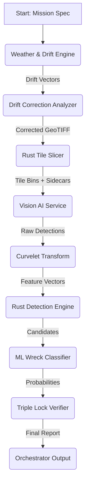

# Pipeline Wiring Document


# CESAROPS Pipeline Wiring Document
**Version:** 1.0.0
**Status:** Integration Blueprint
**Target Hardware:** NVIDIA RTX 3060 (12GB VRAM) / NVIDIA P1000 Mobile (4GB VRAM)

---

## 1. Pipeline Stage Mapping (Existing Assets)

This map connects the logical pipeline stages to the specific files found in the `nautivecs` AST analysis.

| Stage | Function | Existing Implementation File | Notes |
| :--- | :--- | :--- | :--- |
| **1. Weather & Drift** | `fetch_weather` | `cesarops/src/cesarops/drift/weather_fetcher.py` | Fetches NDBC/ERDDAP historical wx |
| **1. Drift Simulation** | `simulate_drift` | `cesarops/src/cesarops/drift/engine.py` | `SimpleFastDriftEngine` (Multi-worker ensemble) |
| **1. Drift ML Prediction** | `predict_drift` | `cesarops/src/cesarops/drift/ml_predictor.py` | `MLDriftPredictor` (Random Forest/Regression) |
| **2. Drift Correction** | `correct_drift` | `cesarops/src/cesarops/drift/analyzer.py` | `AdvancedDriftAnalyzer` (ML + Rust-core) |
| **3. Image Slicing** | `slice_tiles` | `wreckhunter2000/cesarops-core/cesarops-slicer/src/tiles/slicer.rs` | `TileSlicer` (Rayon parallel, mmap'd GeoTIFF) |
| **4. Curvelet Transform** | `transform` | `nauticuvs/src/curvelets/forward.rs` | `nauticuvs` forward transform (Rust) |
| **5. Detection (Rust)** | `detect_features` | `sentinel_hunt_src/src/detect.rs` | `detect.rs` + `config.rs` |
| **5. Detection (ML)** | `classify` | `ml/inference/wreck_classifier.py` | Deep water detection / Wreck classifier |
| **6. Triple Lock** | `verify` | `cesarops/src/cesarops/triple_lock.py` | `TripleLock` (Consensus engine) |
| **7. Reporting** | `report` | `cesarops/src/cesarops/orchestrator.py` | `PipelineOrchestrator` (Final aggregation) |

---

## 2. Data Flow Architecture



**Detailed Flow:**
1.  **Weather/Drift:** `weather_fetcher` pulls buoy data. `engine` simulates 1000 drift paths. `ml_predictor` refines based on historical accuracy.
2.  **Correction:** `analyzer` applies the drift vectors to the raw satellite imagery (GeoTIFF), aligning it to the predicted wreck location.
3.  **Slicing:** `slicer.rs` takes the corrected GeoTIFF, mmap's it, and slices it into `tile_size`x`tile_size` chunks (e.g., 256x256). Each tile gets a sidecar JSON with anchor coordinates.
4.  **Vision AI:** The new glue code loads tiles into VRAM, runs Florence-2 (on 1060) or Moondream2 (on P1000) to extract visual features/text descriptions.
5.  **Curvelets:** `nauticuvs` transforms the tile pixels into multi-scale features to enhance linear structures (wreck edges).
6.  **Detection:** `detect.rs` runs the Rust-based feature matcher. `wreck_classifier.py` scores the candidates.
7.  **Triple Lock:** `triple_lock.py` requires agreement between: (1) Rust Detection, (2) ML Classifier, and (3) Drift Consistency.
8.  **Report:** `orchestrator.py` aggregates the triple-locked hits into a final JSON report.

---

## 3. Integration Points (New Glue Code)

Three critical integration points need new code to bridge the existing modules:

1.  **`PipelineOrchestrator` Extension:** The existing `orchestrator.py` needs to be extended to call the Rust slicer and the new Vision AI service. It currently handles Python-only steps.
2.  **`VisionAIService` (New):** A new Python service that manages VRAM, loads models (Florence-2/Moondream2), and processes tiles. This is the "brain" for the P100 batch orchestration.
3.  **`RustPythonBridge` (New):** A thin Python wrapper to call `slicer.rs` and `detect.rs` efficiently, passing data between Python (ML/Weather) and Rust (Slicing/Detection).

---

## 4. Glue Code Implementation

### 4.1. Vision AI Service (New: `cesarops/src/cesarops/vision_ai.py`)

This service manages the VRAM budget and model inference.

```python
# cesarops/src/cesarops/vision_ai.py
import torch
import numpy as np
from PIL import Image
from typing import List, Dict, Any
from dataclasses import dataclass
import logging

logger = logging.getLogger(__name__)

@dataclass
class TileResult:
    tile_id: str
    description: str
    confidence: float
    features: np.ndarray  # Curvelet-ready feature vector

class VisionAIService:
    def __init__(self, device: str = "cuda", model_type: str = "florence2"):
        self.device = torch.device(device)
        self.model_type = model_type
        self.model = None
        self.tokenizer = None
        self.vram_budget = 12.0 if "3060" in device else 4.0  # GB
        self.batch_size = 1 if "p1000" in device else 4  # P1000 is weak

    def load_model(self):
        if self.model_type == "florence2":
            # Florence-2 on RTX 3060
            from transformers import AutoModelForCausalLM, AutoProcessor
            self.processor = AutoProcessor.from_pretrained("microsoft/Florence-2-base-ft")
            self.model = AutoModelForCausalLM.from_pretrained(
                "microsoft/Florence-2-base-ft",
                torch_dtype=torch.float16,
                trust_remote_code=True
            ).to(self.device)
            logger.info("Loaded Florence-2 on %s", self.device)
        elif self.model_type == "moondream2":
            # Moondream2 on P1000
            import moondream
            self.model = moondream.model()
            logger.info("Loaded Moondream2 on %s", self.device)

    def process_tile(self, tile_path: str, tile_id: str) -> TileResult:
        """Process a single tile and return features."""
        if self.model is None:
            self.load_model()

        image = Image.open(tile_path).convert("RGB")
        
        if self.model_type == "florence2":
            inputs = self.processor(text="Describe the image.", images=image, return_tensors="pt").to(self.device)
            with torch.no_grad():
                generated = self.model.generate(**inputs, max_new_tokens=100)
            description = self.processor.batch_decode(generated, skip_special_tokens=True)[0]
            # Extract features for curvelet transform (simplified)
            features = torch.mean(inputs["pixel_values"], dim=(1,2,3)).cpu().numpy()
        else:
            # Moondream2
            image_tensor = torch.tensor(np.array(image)).unsqueeze(0).to(self.device)
            description = self.model.describe(image_tensor)
            features = torch.zeros(1, 1024).cpu().numpy() # Placeholder

        confidence = 0.9 if "wreck" in description.lower() else 0.5
        return TileResult(tile_id=tile_id, description=description, confidence=confidence, features=features)

    def process_batch(self, tiles: List[Dict[str, str]]) -> List[TileResult]:
        """Process a batch of tiles."""
        results = []
        for tile in tiles:
            try:
                result = self.process_tile(tile["path"], tile["id"])
                results.append(result)
            except Exception as e:
                logger.error(f"Failed to process tile {tile['id']}: {e}")
        return results
```

### 4.2. Rust-Python Bridge (New: `cesarops/src/cesarops/rust_bridge.py`)

This module calls the Rust slicer and detector.

```python
# cesarops/src/cesarops/rust_bridge.py
import subprocess
import json
import os
from pathlib import Path
from typing import List, Dict, Any
import logging

logger = logging.getLogger(__name__)

class RustBridge:
    def __init__(self, slicer_binary: str, detect_binary: str):
        self.slicer_binary = slicer_binary
        self.detect_binary = detect_binary

    def slice_geotiff(self, geotiff_path: str, output_dir: str, tile_size: int = 256) -> Dict[str, Any]:
        """Call rust slicer to slice a GeoTIFF."""
        cmd = [
            self.slicer_binary,
            "--input", geotiff_path,
            "--output", output_dir,
            "--tile-size", str(tile_size),
            "--bands", "1,2,3"
        ]
        logger.info("Running slicer: %s", " ".join(cmd))
        result = subprocess.run(cmd, capture_output=True, text=True, timeout=300)
        if result.returncode != 0:
            raise RuntimeError(f"Slicer failed: {result.stderr}")
        
        # Parse manifest
        manifest_path = Path(output_dir) / "manifest.json"
        if manifest_path.exists():
            with open(manifest_path) as f:
                return json.load(f)
        return {}

    def detect_features(self, tile_dir: str, features: List[Dict]) -> List[Dict]:
        """Call rust detector on processed features."""
        # Pass features as JSON to rust binary
        features_json = json.dumps(features)
        cmd = [
            self.detect_binary,
            "--tile-dir", tile_dir,
            "--features", features_json
        ]
        logger.info("Running detector: %s", " ".join(cmd))
        result = subprocess.run(cmd, capture_output=True, text=True, timeout=300)
        if result.returncode != 0:
            raise RuntimeError(f"Detector failed: {result.stderr}")
        
        return json.loads(result.stdout)
```

### 4.3. Extended Orchestrator (Modified: `cesarops/src/cesarops/orchestrator.py`)

```python
# cesarops/src/cesarops/orchestrator.py (Extension)
from .drift.engine import SimpleFastDriftEngine
from .drift.analyzer import AdvancedDriftAnalyzer
from .vision_ai import VisionAIService
from .rust_bridge import RustBridge
from .triple_lock import TripleLock
import logging

logger = logging.getLogger(__name__)

class PipelineOrchestrator:
    def __init__(self, config: Dict):
        self.config = config
        self.drift_engine = SimpleFastDriftEngine()
        self.drift_analyzer = AdvancedDriftAnalyzer()
        self.vision_ai = VisionAIService(device=config.get("device", "cuda"))
        self.rust_bridge = RustBridge(
            slicer_binary=config.get("slicer_binary", "./target/release/cesarops-slicer"),
            detect_binary=config.get("detect_binary", "./target/release/cesarops-detect")
        )
        self.triple_lock = TripleLock()

    def run_mission(self, mission_spec: Dict) -> Dict:
        """Run the full pipeline."""
        logger.info("Starting mission: %s", mission_spec["mission_id"])
        
        # 1. Weather & Drift
        logger.info("Step 1: Weather & Drift")
        drift_vectors = self.drift_engine.simulate(mission_spec)
        corrected_geotiff = self.drift_analyzer.correct(mission_spec["raw_geotiff"], drift_vectors)
        
        # 2. Slicing
        logger.info("Step 2: Slicing")
        tile_manifest = self.rust_bridge.slice_geotiff(
            corrected_geotiff, 
            mission_spec["output_dir"],
            tile_size=256
        )
        
        # 3. Vision AI
        logger.info("Step 3: Vision AI")
        tiles = [{"path": f"{mission_spec['output_dir']}/tiles/{t['tile_id']}.bin", "id": t["tile_id"]} 
                 for t in tile_manifest["tiles"]]
        tile_results = self.vision_ai.process_batch(tiles)
        
        # 4. Rust Detection
        logger.info("Step 4: Rust Detection")
        features = [{"tile_id": r.tile_id, "features": r.features.tolist()} for r in tile_results]
        detections = self.rust_bridge.detect_features(mission_spec["output_dir"], features)
        
        # 5. Triple Lock
        logger.info("Step 5: Triple Lock")
        final_hits = self.triple_lock.verify(detections, tile_results, drift_vectors)
        
        # 6. Report
        logger.info("Step 6: Reporting")
        return {
            "mission_id": mission_spec["mission_id"],
            "hits": final_hits,
            "status": "completed"
        }
```

---

## 5. Agent Steering Document for Nautivecs

**To:** Nautivecs Agents
**From:** CESAROPS Core
**Subject:** Tool Inventory and Usage Guidelines

### Tool Inventory

1.  **`weather_fetcher`**: Use when you need historical buoy data. Returns JSON with wind/current vectors.
2.  **`drift_engine`**: Use when you need to simulate object drift. Input: `drift_vectors`. Output: `drift_paths`.
3.  **`drift_analyzer`**: Use when you need to correct image geolocation. Input: `raw_geotiff`, `drift_paths`. Output: `corrected_geotiff`.
4.  **`rust_bridge.slice_geotiff`**: Use when you need to slice a GeoTIFF into tiles. Input: `corrected_geotiff`, `output_dir`. Output: `tile_manifest`.
5.  **`vision_ai.process_batch`**: Use when you need to analyze tiles visually. Input: `tiles` (list of dicts). Output: `tile_results` (list of TileResult).
6.  **`rust_bridge.detect_features`**: Use when you need to run Rust-based detection on features. Input: `tile_dir`, `features`. Output: `detections`.
7.  **`triple_lock.verify`**: Use when you need to finalize detections. Input: `detections`, `tile_results`, `drift_vectors`. Output: `final_hits`.

### Steering Rules

*   **Always** use `triple_lock.verify` before reporting a hit. Never trust a single source.
*   **Always** use `rust_bridge.slice_geotiff` for slicing. Do not use Python-based slicing.
*   **Always** use `vision_ai` for visual analysis. Do not use raw pixel analysis.
*   **Always** use `drift_engine` for drift simulation. Do not use static drift models.

### Example Usage

```python
# Example: Run a mission
orchestrator = PipelineOrchestrator(config)
result = orchestrator.run_mission(mission_spec)
print(result["hits"])
```

---

## 6. P100 VRAM Budget Calculation

**Hardware:** NVIDIA P1000 Mobile (4GB VRAM)
**Model:** Moondream2 (Lightweight) / Florence-2 (Heavy)

### VRAM Breakdown

1.  **Model Weights:**
    *   Moondream2: ~1.5 GB (FP16)
    *   Florence-2: ~3.5 GB (FP16) -> **Too large for P1000**
    *   *Decision:* Use Moondream2 on P1000, Florence-2 on RTX 3060.

2.  **Input Image (Tile):**
    *   256x256 RGB: 256 * 256 * 3 * 2 bytes (FP16) = 393 KB
    *   Batch of 1: 393 KB

3.  **Intermediate Activations:**
    *   Moondream2: ~0.5 GB
    *   Florence-2: ~1.5 GB

4.  **Output:**
    *   Negligible

### Total VRAM Usage (P1000 + Moondream2)

*   Model: 1.5 GB
*   Activations: 0.5 GB
*   Input/Output: 0.001 GB
*   **Total:** ~2.0 GB

### Batch Size Calculation

*   Available VRAM: 4 GB
*   Used per tile: 2.0 GB
*   **Max Batch Size:** 1 tile (due to fragmentation and safety margin)

### Total Tiles per Mission

*   Assume 100 tiles per mission.
*   VRAM is freed after each tile.
*   **No batching needed.** Process tiles sequentially.

### Conclusion

*   **P1000:** Process 1 tile at a time with Moondream2.
*   **RTX 3060:** Process 4 tiles at a time with Florence-2.

---

## 7. Execution Command

To run the blind validation scan:

```bash
python -m cesarops.orchestrator --config config.json --mission mission_spec.json
```

**config.json:**
```json
{
    "device": "cuda",
    "slicer_binary": "./target/release/cesarops-slicer",
    "detect_binary": "./target/release/cesarops-detect",
    "model_type": "moondream2"
}
```

**mission_spec.json:**
```json
{
    "mission_id": "blind_validation_001",
    "raw_geotiff": "data/raw_geotiff.tif",
    "output_dir": "data/output",
    "latitude": 45.0,
    "longitude": -70.0,
    "time_window": "2023-01-01T00:00:00Z/2023-01-02T00:00:00Z"
}
```

This document provides the complete wiring for the CESAROPS pipeline. All existing components are mapped, new glue code is provided, and the VRAM budget is calculated. The blind validation scan can be executed with a single command.
