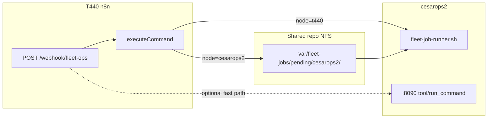

# Fleet ops via n8n (no SSH)

n8n on **T440** (`:5678`) can run fleet scripts on any node that shares the repo over NFS — without SSH.

## How it works



| Target | Mechanism |
|--------|-----------|
| **t440** | n8n `executeCommand` runs `scripts/fleet-job-runner.sh` locally |
| **cesarops2** | n8n writes `var/fleet-jobs/pending/cesarops2/*.json` on NFS (from T440) |
| **cesarops2 (fast)** | Optional HTTP `POST :8090/tool/run_command` → runs job runner immediately |

`executeCommand` always runs **on the host where n8n is installed**. Shared drives do **not** execute code on cesarops2 by themselves — you need the **NFS queue** and a runner on cesarops2 (timer or MCP trigger).

## Import workflow

```bash
# On T440 (see FORGE_DEPLOYMENT.md)
n8n import:workflow --input=missions/n8n_fleet_ops_dispatch.json
```

Webhook: `POST http://127.0.0.1:5678/webhook/fleet-ops`

```json
{
  "node": "cesarops2",
  "action": "install_cake",
  "repo": "/codebase/repos/wreckhunter2000-1"
}
```

## CLI wrapper

```bash
bash scripts/fleet-n8n-dispatch.sh cesarops2 install_cake
bash scripts/fleet-n8n-dispatch.sh t440 prep_post_pipeline
```

Env:

- `N8N_FLEET_OPS_URL` — default `http://127.0.0.1:5678/webhook/fleet-ops`
- `FLEET_DISPATCH=auto|n8n|nfs|ssh` — `start-fleet-cluster.sh` uses `auto` (n8n/NFS, not SSH)

## cesarops2 job runner

Enable after import (optional if you rely on MCP `:8090` only):

```bash
sudo cp systemd/cesarops-fleet-job-runner.* /etc/systemd/system/
sudo systemctl daemon-reload
sudo systemctl enable --now cesarops-fleet-job-runner.timer
```

Polls every 30s: `var/fleet-jobs/pending/cesarops2/*.json`

## Actions

| action | Script |
|--------|--------|
| `install_cake` | `install_cake_fleet.sh` |
| `cake_worker_start` | `cake/start-worker-local.sh` |
| `cake_worker_stop` | pkill cake worker |
| `cake_fleet_start` | `cake/start-fleet-cluster.sh` |
| `prep_post_pipeline` | `prep_post_pipeline.sh` |

## vs PAMP / satellite pipeline

Same n8n instance as PAMP (`/webhook/pamp-route`) and satellite `executeCommand` flows — fleet ops are **separate webhooks**, safe to call during pipeline if the action does not free GPUs (e.g. `prep_post_pipeline`, `install_cake`).

Do **not** dispatch `cake_fleet_start` or `p100_cycle free` while a satellite mission is `running`.
