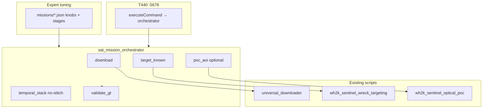

# Satellite imagery pipeline — deep dive & tuning guide

Mag pipeline parity: **edit JSON → run orchestrator → read `mission_report.json`**.  
Satellite path: `pipelines/satellite/sat_mission_orchestrator.py` + `missions/*.json`.

## Architecture



## What works today

| Component | Status |
|-----------|--------|
| Multi-source download | `universal_downloader.py` + area presets |
| Known-site Sentinel scoring | `wh2k_sentinel_wreck_targeting` (3 concepts, z-score, hit_rate) |
| AOI discovery | `wh2k_sentinel_optical_poc` |
| JSON orchestrator | **NEW** `sat_mission_orchestrator.py` |
| GT validation report | **NEW** `validation_report.json` vs `known_wrecks.json` |
| n8n workflow | **NEW** `missions/n8n_satellite_optical_workflow.json` |
| Triple-lock | `:5580/scan` — needs real tiles (not wired from sat orchestrator yet) |

## What is stubbed / missing

| Gap | Notes |
|-----|--------|
| `wrecks.db` | Targeting defaults to Erie DB; orchestrator uses **`known_wrecks.json`** via `--coords` |
| `scan_engine` / 7-pass | Backup only; not production |
| Forge `MeanOfMeans` stitching | Planned in orchestrator.rs, **not executed** |
| `overlay_grid.rs` | Backup only — shape fiducials for align-without-stitch |
| Full temporal ratio download | `temporal_stack_engine` v1 catalogs STAC; v2 = per-chip band stacks |
| Curvelet on satellite | Mag uses `nauticuvs` FDCT; satellite scan uses LoG proxy |
| Webhook `knobs` | Forge `/webhook/mission` still scenario+bbox only |

## Temporal stack without stitching

Design: [`docs/slicer_alternative_spec.md`](slicer_alternative_spec.md)

- **Do not** mosaic full Sentinel tiles on GPU.
- **Do** stack 10+ dates of **single-band ratios** (NDWI/NDVI) per wreck chip on each P100.
- Cross-verify window A vs window B (recent vs older 10 scenes).
- Promote `backup/deploy/tools/overlay_grid.rs` for sub-pixel stamp alignment before stack.

`temporal_stack` stage writes `temporal_stack_report.json` with scene catalog; pair with `target_known` for band chips.

## Research additions (2024–2026)

| Source | Relevance |
|--------|-----------|
| Multitemporal Sentinel-2 archaeology (MDPI) | Seasonal indices + PCA — aligns with `shadow_roughness` / `zebra_clarity` seasons |
| Landsat sediment plumes (NASA) | Validates `sediment_plume` concept + post-storm pairing |
| Submerged ML mostly sonar | Satellite remains shallow/turbid + plume proxy; keep triple-lock |

## Run commands

```bash
# Dry-run (download catalog only + GT load)
python3 pipelines/satellite/sat_mission_orchestrator.py \
  --spec pipelines/satellite/missions/straits_known_wreck_validation.json \
  --dry-run

# Live known-wreck validation (needs network for STAC)
python3 pipelines/satellite/forge_cli.py mission \
  --spec pipelines/satellite/missions/straits_known_wreck_validation.json \
  --knobs '{"dry_run_download":true,"max_scenes":4}'

# n8n: import pipelines/satellite/missions/n8n_satellite_optical_workflow.json
```

## Knob reference (DEFAULT_KNOBS)

See `sat_mission_orchestrator.py` — tune in mission JSON:

- **download:** `sensors`, `max_download_results`, `dry_run_download`
- **targeting:** `concepts`, `max_scenes`, `min_score`, `min_gt_score`, `min_gt_hit_rate`
- **temporal:** `temporal_max_scenes`, `tiles_per_gpu_window`, `gpu_windows`, `temporal_persistence_z`
- **curvelet (future):** `use_curvelet_rescore`, `curvelet_window_px`, `curvelet_energy_threshold`

## Known wreck ground truth

Primary: `backup/deploy/tools/cesarops-core-github/known_wrecks.json` (bbox centers).  
Straits test names: Cedarville, Eber Ward, Cayuga, Gilcher.

## cesarops2 @ 10.0.0.201

Same paths via NFS: `/mnt/t440/codebase/projects/pipelines/satellite/`.  
`source ~/.config/cesarops/mag_paths.env` — use `CESAROPS_PIPELINES` for satellite.

## Next implementation priorities

1. **temporal_stack v2** — download B03/B08 chips per scene, stack ratios in chip space.
2. **Wire overlay_grid** into stamp/align before stack.
3. **Curvelet rescore** on satellite windows via `nauticuvs_mag_curvelet.py`.
4. **Export targeting CSV → detection_scan** tiles for triple-lock.
5. **Forge webhook** accept `spec_path` + `days_back`.
