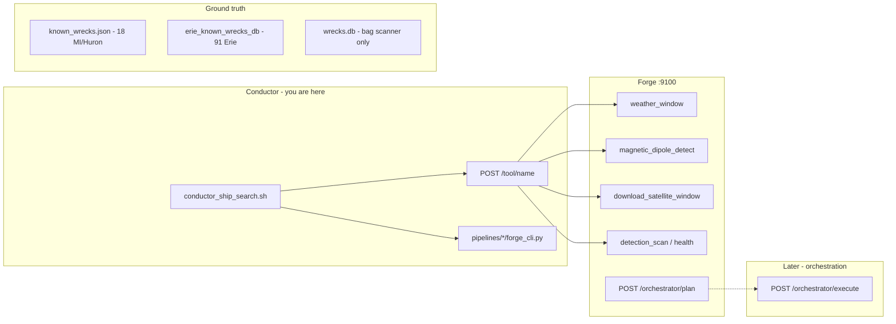

# Great Lakes ship search — conductor mode

Run tool tests **without** full `orchestrator/execute` until each layer passes.

## Architecture (three layers)



| Layer | Role | Status |
|-------|------|--------|
| **Pipelines** | `/mnt/data-external/projects/pipelines` → symlink `repo/pipelines` | Wired |
| **Forge tools** | `POST /tool/{name}` with `{"arguments":{...}}` | Use full binary below |
| **Orchestrator** | `plan` → `execute` mission chain | Defer until tools green |

## Run the conductor

```bash
/codebase/repos/wreckhunter2000-1/scripts/conductor_ship_search.sh
# Report: /tmp/conductor_ship_search_*.md
```

**Forge binary:** systemd and `target/release/cesarops-forge-v2` can be a **stale 10MB build** missing `/tool/*` and `/orchestrator/*`. Use the workspace-linked binary:

```bash
BIN=$(ls -t /codebase/repos/wreckhunter2000-1/cesarops-forge-v2/target/release/deps/cesarops_forge_v2-* | grep -v '\.d$' | head -1)
cp "$BIN" /tmp/forge-install/bin/cesarops-forge-v2
sudo systemctl restart cesarops-forge-v2
```

## Tool matrix (Great Lakes)

| Tool | Known-object test | Unknown-object test |
|------|-------------------|---------------------|
| `erie_known_wrecks_db.py` | 91 Erie wrecks with coords | — |
| `known_wrecks.json` | Andaste, Gilcher, Parnell bboxes | Mid-lake probe >2km from catalog |
| `magnetic_dipole_detect` | Synthetic dipole + Colgate @ 692m | Well @ 138m → `suspected_wellhead` |
| `detection_health` | Service up on :5580 | Workers offline = degraded 2-lock |
| `detection_scan` | `region=lake_michigan_wreck_scan` | Empty tiles = smoke only |
| `weather_window` | bbox center → Open-Meteo | Needs network; repo `weather_service.py` |
| `download_satellite_window` | bbox + Earthdata creds | Long-running; skip in conductor |

## Orchestrator plan payload

```json
{
  "raw_text": "wreck hunt freighter south Lake Michigan",
  "bbox": [41.8, -87.2, 42.2, -86.8],
  "days_back": 14
}
```

WreckHunt plan modules: `weather_window` → `download_satellite_window` → `magnetic_dipole_detect` → `detection_scan`.

## Gaps before `execute`

1. **Mag worker** — `cesarops-aeromagnetic-worker` ignores `--grid`; uses synthetic grid + hardcoded Erie fixtures.
2. **Mag mission** — orchestrator passes `/tmp/forge_mag_grid.csv` (stub).
3. **Detection workers** — scout/validator/jitter offline; service shell on :5580 only.
4. **Erie direct match** — needs `adaptive_bg_erie_1000yd/*.csv` harvest artifacts (not on disk).
5. **`wrecks.db`** — bag scan metadata, not Swayze wreck census.

## Next steps

1. `bash cesarops-detection/scripts/start.sh` + start scout/validator workers.
2. Harvest Erie mag grid → real `grid_path` for `magnetic_dipole_detect`.
3. Re-run conductor; then one bbox `POST /orchestrator/execute` with `priority` and `bbox` set.
